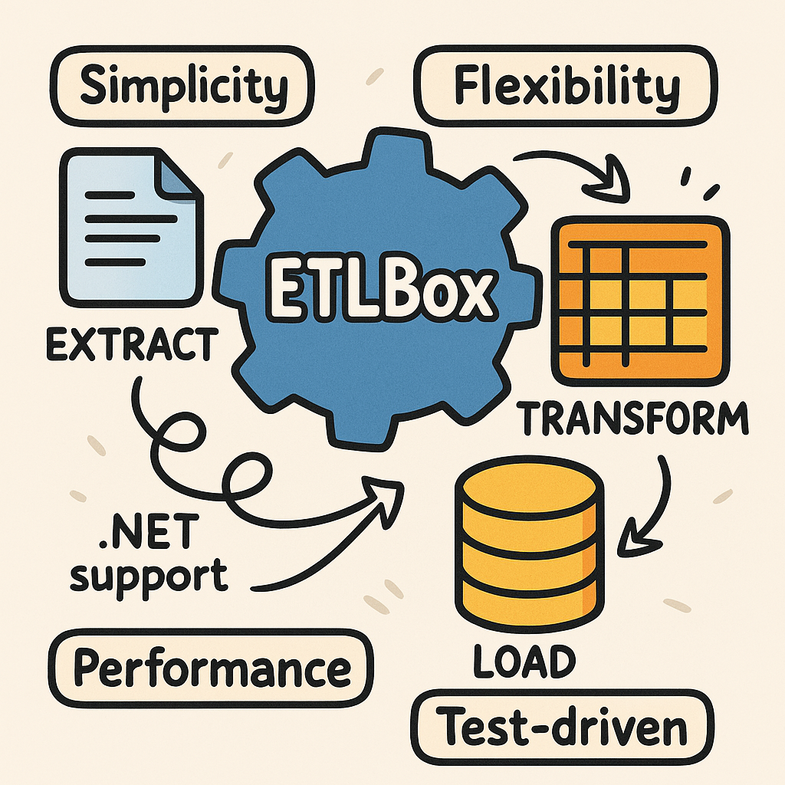




  
  
  





### The Nitty-Gritty

In the world of data management, ETL is critical. It extracts data from a plethora of sources, transforms it into a desired format, and loads it into a target system like a data warehouse or database. This is where ETLBox shines. This nimble yet robust .NET library doesn’t come with a User Interface, setting it apart from other ETL tools like SQLServer Integration Services (SSIS) or Azure Data Factory. But no worries! This emphasizes the advantage of crafting data flows programmatically – a genuine game-changer for numerous ETL and data integration challenges.

ETLBox simplifies the extraction, transformation, and loading (ETL) of data, supporting a wide range of data sources and targets and providing a set of straightforward, yet powerful components for automating these tasks. Here’s what ETLBox brings to the table:

- **Simplicity**: With its user-friendly API, navigating the ETL processes becomes a breeze.
- **Flexibility**: Adapt various data transformations including lookups, column splitting, and data aggregation with ETLBox’s versatile features.
- **Performance**: Stand out in performance with ETLBox’s guarantee of high-speed and efficient handling of substantial data volumes.
- **.NET Support**: Fully integrated with the .NET framework and written in C#, ETLBox is a natural fit for .NET developers.
- **Test-driven**: ETLBox is the only ETL framework that supports Test-driven development right from the start, underscoring its commitment to robust and reliable ETL processes.

In a nutshell, ETLBox is not just a tool. It’s a comprehensive solution for your specific ETL needs. It allows developers to use .NET to code their ETL job, ensuring seamless data management from extraction to loading.


### Understanding ETL

ETL is the foundation of modern Business Intelligence applications. It separates the analysis part from everything that comes before it. ETL, standing for extract, transform, and load, embodies a three-step process:

- **Extracting:** Gathering data from a specific source in its rawest form, ensuring all relevant data is gathered.
- **Transforming:** Cleaning and harmonizing the data, making it easy for the end user to read, and ensuring high data quality by removing duplicates and sorting data into relevant categories.
- **Loading:** The ETL tool then harmonizes your data and loads it into a target location, making it ready for analysis.

### What is a Data Flow?

ETLBox empowers you to construct an efficient ETL pipeline with its comprehensive set of Data Flow components. In constructing a Data Flow pipeline with ETLBox, define, link, and execute the components. This process allows for asynchronous data processing, optimizing flow and memory usage. Direct connections between sources and destinations are possible, providing flexibility and efficiency. Components process data as it’s read, promoting continuous data movement and processing, and enabling optimized throughput for various operations.

### How to Get ETLBox

ETLBox, developed in C#, targets .NET Standard 2.0 and higher, ensuring compatibility with various .NET versions, including .NET Framework 4.X and above, .NET Core 2.X and above, and .NET 5.0 and 6.0. All ETLBox packages are hosted on NuGet. Installing the core package is essential for working with ETLBox as it contains default connectors and transformations. Integrate it into your project using the NuGet package manager with the command: `dotnet add package ETLBox`. Choose the appropriate connector package based on your needs, for connecting to SQLServer databases or loading data from a Json file or REST endpoint, for example. [Visit the project home page for more information.](https://www.etlbox.net)

## Data Flow by Example

In this example, let's assume we receive supplier data in a file daily. As a first step, we want to copy these data to a database table.

### Preparation

First, we need an example file with supplier data. In our example, we use the CSV format, but essentially, ETLBox supports every other common format, including proprietary ones. Should the data source change later on, like the supplier data coming from a REST service instead of a file, this can be adjusted relatively quickly and easily without affecting the rest of the data flows.

#### CSV File

Below is the content of the CSV file:

```csv
Name,Code,Custom,Country,Contact,TraceInfo
"HoneyPot Inc ",CO110,HP,UK,"Peter",XC
"AppleBees Corp",CO200,AB,DE,"Paul",
" Peach United",CO301,PU,CH,"Mary",ED
"Rainbow Software",,,,
"Data Soft Ltd.",D1000,DS,XX,"Ruby",A
"Data Soft Unlimted",D1000,DS,US,"Rucy",B
"Data Hard",D1000,DS,IE,"Lucy",C
"Unicorn 1",UNI10,U,IE,"Trippi",AS
"Unicorn 2",UNI20,U,,X,X
```

#### Database Table

We also need a target table, let’s call it `VendorMaster`. Let’s create three entries in this table:

VendorName|Code|Custom|Country|Contact|Info
----------|----|------|-------|-------|-----
Big Holding|H1234|HD|US|Hans|T0
Unicorn|UNI10|U|NO||
Another Unicorn|UNI20|U|SE||

Here is the code to create this table:

```C#
//Adjust connection string to your local database
string SqlConnectionString = @"Data Source=localhost;User Id=sa;Password=YourStrong@Passw0rd;Initial Catalog=demo;TrustServerCertificate=true";

//Prepare the target database
SqlConnectionManager connectionManager = new SqlConnectionManager(SqlConnectionString);
DropTableTask.DropIfExists(connectionManager, "VendorMaster");
CreateTableTask.CreateIfNotExists(connectionManager, "VendorMaster",
    new List<TableColumn>() {
        new TableColumn() { Name = "Id", DataType = "INT", AllowNulls = false, IsPrimaryKey = true, IsIdentity = true },
        new TableColumn() { Name = "VendorName", DataType = "VARCHAR(100)", AllowNulls = false },
        new TableColumn() { Name = "Code", DataType = "CHAR(5)", AllowNulls = false },
        new TableColumn() { Name = "Custom", DataType = "VARCHAR(10)", AllowNulls = false },
        new TableColumn() { Name = "Country", DataType = "CHAR(3)", AllowNulls = true },
        new TableColumn() { Name = "Contact", DataType = "VARCHAR(50)", AllowNulls = true },
        new TableColumn() { Name = "Info", DataType = "VARCHAR(50)", AllowNulls = true },
    });
SqlTask.ExecuteNonQuery(connectionManager,
    @"INSERT INTO VendorMaster (VendorName, Code, Custom, Country, Contact, Info)
        VALUES('Big Holding', 'H1234', 'HD', 'US', 'Hans', 'T0')");
SqlTask.ExecuteNonQuery(connectionManager,
    @"INSERT INTO VendorMaster (VendorName, Code, Custom)
        VALUES('Unicorn', 'UNI10', 'U', 'NO')");
SqlTask.ExecuteNonQuery(connectionManager,
    @"INSERT INTO VendorMaster (VendorName, Code, Custom)
        VALUES('Another Unicorn', 'UNI20', 'U', 'SE')");
```

If someone does not have a database installed, it can be started in a container using Docker Desktop with just a few commands. See also: https://hub.docker.com/_/microsoft-mssql-server

### Requirements for the Data Flow

In this section, we will build an ETL data flow with ETLBox. One of the ETL steps in loading data is cleansing and checking for duplicates.

In our data flow, we first want to check the data for validity. The fields Name, Code, and Custom must not be empty. The Name must be between 5 and 50 characters, and the Code should be exactly 5 characters long.

We also want to clean the data. We want to trim any additional spaces at the beginning and end of the Name and Code fields. All vendor names should be stored in uppercase.

Next, we want to check the data for duplicates. We want to ensure that there are no entries in the target database with the same combination of the Code/Custom columns. There should also be no entries within the file with the same Code & Custom combination.

We want to write all faulty records to a log file. In this example, we choose JSON as the target format.


#### Creating the Data Model

For the first step, we'll set up a class that represents our data model.

```C#
public class VendorMaster
{

    [DbColumnMap("VendorName")]
    public string Name { get; set; }

    [DistinctColumn]
    public string Code { get; set; }

    [DistinctColumn]
    public string Custom { get; set; }

    public string Country { get; set; }

    public string Contact { get; set; }

    [CsvHelper.Configuration.Attributes.Name("TraceInfo")]
    public string Info { get; set; }

    public int? DbId { get; set; }
    public bool IsInDb => DbId.HasValue && DbId > 0;

    public VendorMaster Normalize() {
        this.Name = Name.Trim().ToUpper();
        this.Contact = Contact.Trim();
        return this;
    }

    public bool IsValid() {

        if (string.IsNullOrEmpty(Name) || string.IsNullOrEmpty(Code) || string.IsNullOrEmpty(Custom))
            return false;
        if (Name.Length < 5 || Name.Length > 50)
            return false;
        if (Code.Length != 5)
            return false;
        return true;
    }
}
```

This class is already provided with additional information:
- We use `DbColumnMap("VendorName")` to indicate that the database name is "VendorName", but we receive `Name` in the CSV file.
- The `DistinctColumn` attribute specifies the two fields that must not be duplicated.
- For the `TraceInfo` field, we approach it differently than with `Name` - we already specify the field as `Info`, and with the help of the attribute `CsvHelper.Configuration.Attributes.Name`, it gets assigned to the `TraceInfo` column in the CSV file.
- Additionally, we've implemented two methods: one to normalize the data and another to validate its correctness.

#### Defining the Data Flow Components

To meet these requirements with a data flow, we need various components. We can read the data from the CSV file with a CsvSource.

Here is an overall view:

```C#
var source = new CsvSource<VendorMaster>("sourceData.csv");
var normalize = new RowTransformation<VendorMaster>(row => row.Normalize());
var errorTarget = new JsonDestination<VendorMaster>("errors.json");
var dbTarget = new DbDestination<VendorMaster>(connectionManager, "VendorMaster");
var duplicateCheck = new Distinct<VendorMaster>();
var lookupExisting = new LookupTransformation<VendorMaster, VendorMasterDbEntry>();
var lookupSource = new DbSource<VendorMasterDbEntry>(connectionManager, "VendorMaster");
lookupExisting.Source = lookupSource;
```

With the CsvSource, we determine the source of our data flow. The RowTransformation then takes each incoming row and applies the Normalize function. The `errorTarget` defines the file "errors.json" as a Json destination. The `dbTarget` describes our target table in the database. The `Distinct` transformation checks for duplicates based on the `DistinctColumn` attribute. The `LookupTransformation` loads the data from the `dbSource` and determines an already existing database ID.

#### Linking the Data Flow Components

Now, we need to connect these components. This is accomplished by using the LinkTo method, which routes data from one component to the next when the data flow is started. If there’s no filtering condition (predicate), data moves unfiltered.

```C#
source.LinkTo(normalize);

normalize.LinkTo(lookupExisting, row => row.IsValid());
normalize.LinkTo(errorTarget, row => !row.IsValid());

lookupExisting.LinkTo(duplicateCheck, row => !row.IsInDb);
lookupExisting.LinkTo(errorTarget, row => row.IsInDb);

duplicateCheck.LinkTo(dbTarget);
duplicateCheck.LinkDuplicatesTo(errorTarget);
```

#### Predicates

When linking components in a data flow, you have the option to add a filter expression to the link, known as a predicate. This filter expression is assessed for every row that passes through the link. If the expression evaluates to true, the data will continue to the linked component. If it evaluates to false, the data flow will attempt the next link to transmit its data through.

This example code will split up the data from the source and send it into three different destinations, depending on their `Value`:

```C#
source.LinkTo(dest1, row => row.Value == "A");
source.LinkTo(dest2, row => row.Value == "B");
source.LinkTo(dest3, row => row.Value != "A" && row.Value != "B");
```

This mechanism allows for the partitioning of data from the source, sending it into various destinations based on their values. The data will be sent only into one of the connected links. If there is more than one link, the first link that either has no predicate or whose predicate returns true is used. If you wish to duplicate your data, consider adding a Multicast into your flow.

Ensure that all records are sent to any type of destination. If not all records arrive at a destination, your data flow may never complete as it will wait for all records to be processed.


#### Running the Network

Finally, the entire network is initiated with just a simple command:

```C#
await Network.ExecuteAsync(source);
```

**Note**: Regardless of whether a network is started synchronously with `Execute` or asynchronously with `ExecuteAsync`, the individual components are always run asynchronously. This means that data from the CSV source is read concurrently while some of the data is already being processed or written into the target table. In our example, this might not play a significant role due to the small amount of data. However, with a larger dataset (e.g., 1 million suppliers), this concurrent execution becomes noticeable.

### Result

After executing, we obtain the following data in our target table:

Id|VendorName|Code|Custom|Country|Contact|Info
--|----------|----|------|-------|-------|----
1|BIG HOLDING|H1234|HD|US|Hans|T0
2|UNICORN|UNI10|U|NO||
3|UNICORN TWO|UNI20|U|SE||
4|HONEYPOT INC|CO110|HP|UK|Peter|XC
5|APPLEBEES CORP|CO200|AB|DE|Paul|
6|PEACH UNITED|CO301|PU|CH|Mary|ED
7|DATA SOFT LTD.|D1000|DS|XX|Ruby|A


The Errors.Json file contains the following content:

```json
[
  {
    "Name": "RAINBOW SOFTWARE",
    "Code": "",
    "Custom": "",
    "Country": "",
    "Contact": "",
    "Info": "",
    "IsInDb": false
  },
  {
    "Name": "DATA SOFT UNLIMTED",
    "Code": "D1000",
    "Custom": "DS",
    "Country": "US",
    "Contact": "Rucy",
    "Info": "B",
    "IsInDb": false
  },
  {
    "Name": "DATA HARD",
    "Code": "D1000",
    "Custom": "DS",
    "Country": "IE",
    "Contact": "Lucy",
    "Info": "C",
    "IsInDb": false
  },
  {
    "Name": "UNICORN 1",
    "Code": "UNI10",
    "Custom": "U",
    "Country": "IE",
    "Contact": "Trippi",
    "Info": "AS",
    "DbId": 2,
    "IsInDb": true
  },
  {
    "Name": "UNICORN 2",
    "Code": "UNI20",
    "Custom": "U",
    "Country": "",
    "Contact": "X",
    "Info": "X",
    "DbId": 3,
    "IsInDb": true
  }
]
```

Our data flow has successfully read the CSV files, normalized, and cleansed them. Duplicates within the file and the database were identified. The error file contains the filtered data.

### Complete code overview

Here is an overview of the whole code the example. 

```C#
//Adjust connection string to your local database
string SqlConnectionString = @"Data Source=localhost;User Id=sa;Password=YourStrong@Passw0rd;Initial Catalog=demo;TrustServerCertificate=true";

//Prepare the target database
SqlConnectionManager connectionManager = new SqlConnectionManager(SqlConnectionString);
DropTableTask.DropIfExists(connectionManager, "VendorMaster");
CreateTableTask.CreateIfNotExists(connectionManager, "VendorMaster",
    new List<TableColumn>() {
        new TableColumn() { Name = "Id", DataType = "INT", AllowNulls = false, IsPrimaryKey = true, IsIdentity = true },
        new TableColumn() { Name = "VendorName", DataType = "VARCHAR(100)", AllowNulls = false },
        new TableColumn() { Name = "Code", DataType = "CHAR(5)", AllowNulls = false },
        new TableColumn() { Name = "Custom", DataType = "VARCHAR(10)", AllowNulls = false },
        new TableColumn() { Name = "Country", DataType = "CHAR(2)", AllowNulls = true },
        new TableColumn() { Name = "Contact", DataType = "VARCHAR(50)", AllowNulls = true },
        new TableColumn() { Name = "Info", DataType = "VARCHAR(50)", AllowNulls = true },
    });
SqlTask.ExecuteNonQuery(connectionManager,
    @"INSERT INTO VendorMaster (VendorName, Code, Custom, Country, Contact, Info)
        VALUES('BIG HOLDING', 'H1234', 'HD', 'US', 'Hans', 'T0')");
SqlTask.ExecuteNonQuery(connectionManager,
    @"INSERT INTO VendorMaster (VendorName, Code, Custom,Country)
        VALUES('UNICORN', 'UNI10', 'U', 'NO')");
SqlTask.ExecuteNonQuery(connectionManager,
    @"INSERT INTO VendorMaster (VendorName, Code, Custom,Country)
        VALUES('UNICORN TWO', 'UNI20', 'U', 'SE')");


//Create the data flow components
var source = new CsvSource<VendorMaster>("sourceData.csv");
var normalize = new RowTransformation<VendorMaster>(row => row.Normalize());
var errorTarget = new JsonDestination<VendorMaster>("errors.json");
var dbTarget = new DbDestination<VendorMaster>(connectionManager, "VendorMaster");
var duplicateCheck = new Distinct<VendorMaster>();
var lookupExisting = new LookupTransformation<VendorMaster, VendorMasterDbEntry>();
var lookupSource = new DbSource<VendorMasterDbEntry>(connectionManager, "VendorMaster");
lookupExisting.Source = lookupSource;

/* Linking the components */
source.LinkTo(normalize);

normalize.LinkTo(lookupExisting, row => row.IsValid());
normalize.LinkTo(errorTarget, row => !row.IsValid());

lookupExisting.LinkTo(duplicateCheck, row => !row.IsInDb);
lookupExisting.LinkTo(errorTarget, row => row.IsInDb);

duplicateCheck.LinkTo(dbTarget);
duplicateCheck.LinkDuplicatesTo(errorTarget);

//Execute the network
await Network.ExecuteAsync(source);

Console.WriteLine("Done!");

public class VendorMaster
{

    [DbColumnMap("VendorName")]
    public string Name { get; set; }

    [DistinctColumn]
    public string Code { get; set; }

    [DistinctColumn]
    public string Custom { get; set; }

    public string Country { get; set; }

    public string Contact { get; set; }

    [CsvHelper.Configuration.Attributes.Name("TraceInfo")]
    public string Info { get; set; }

    public int? DbId { get; set; }
    public bool IsInDb => DbId.HasValue && DbId > 0;

    public VendorMaster Normalize() {
        this.Name = Name.Trim().ToUpper();
        this.Contact = Contact.Trim();
        return this;
    }

    public bool IsValid() {

        if (string.IsNullOrEmpty(Name) || string.IsNullOrEmpty(Code) || string.IsNullOrEmpty(Custom))
            return false;
        if (Name.Length < 5 || Name.Length > 50)
            return false;
        if (Code.Length != 5)
            return false;
        return true;
    }

}

public class VendorMasterDbEntry
{
    [RetrieveColumn(nameof(VendorMaster.DbId))]
    public int Id { get; set; }
    [MatchColumn(nameof(VendorMaster.Code))]
    public string Code { get; set; }
    [MatchColumn(nameof(VendorMaster.Custom))]
    public string Custom { get; set; }
}
```


## Conclusion

The ETLBox library provides a comprehensive set of tools for building efficient and scalable ETL solutions within the .NET ecosystem. It allows developers to define complex data flow pipelines with ease, providing robust error handling, data transformation, and validation features out-of-the-box. It offers:

- Flexibility and Adaptability: It can connect to various data sources and targets, facilitating seamless data integration across diverse platforms and technologies.
- Programmability: It lets developers code their ETL process using .NET, providing more control and customization over the ETL processes.
- Performance: It handles substantial data volumes efficiently, ensuring high-speed data processing and loading.
- Testability: Being a test-driven framework, it emphasizes the importance of robust and reliable ETL processes, allowing developers to ensure the correctness and efficiency of their ETL workflows.

In our example, we built a small ETL pipeline to process a CSV file, perform data validation and normalization, and load the cleaned data into a database, handling errors and duplicates gracefully. The process involved defining a data model, setting up various data flow components, linking them together, and executing the network.

### Next article: Adding SCD Type 2

[In the **next step**, we will turn to improvements of this data flow](../data-validation-part2). In addition to enhanced error logging, we will address the issue of how to reconcile data when repeatedly loading different or the same supplier data. We aim to build a Slowly Changing Dimension Type 2 (SCD Type 2) that stores the corresponding changes in the CSV data.


  
  
  



