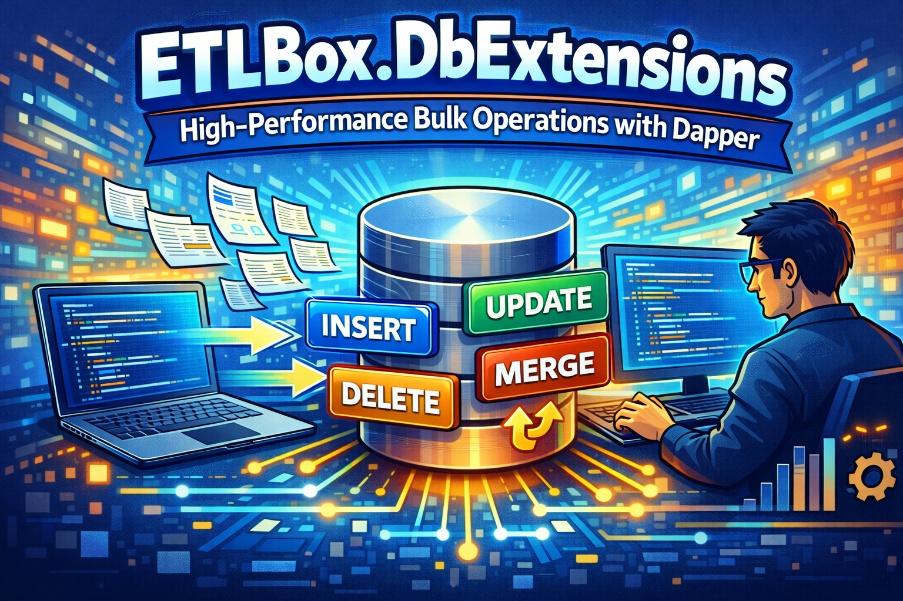

**ETLBox.DbExtensions** addresses this gap by adding high-performance bulk operations directly to `IDbConnection`. It integrates cleanly with existing ADO.NET and Dapper workflows while keeping the API minimal and easy to adopt.

## What Is DbExtensions?

ETLBox.DbExtensions is a lightweight extension library that enhances ADO.NET connections with **bulk insert, update, delete, and merge capabilities**.

Instead of introducing a new abstraction layer, DbExtensions works directly on `IDbConnection`, allowing developers to continue using their existing database access patterns while gaining efficient bulk write support.

### Key Features

* **Bulk operations for ADO.NET**
  Works directly with `IDbConnection`

* **Designed for Dapper compatibility**
  Ideal companion for Dapper-based querying

* **Minimal setup**
  Install the package and start using it immediately

## How DbExtensions Works

At its core, DbExtensions internally converts an ADO.NET connection into an ETLBox connection manager and uses ETLBox’s optimized bulk-operation infrastructure to execute these operations efficiently.

DbExtensions adds extension methods to `IDbConnection`. When a bulk operation is invoked:

1. The existing ADO.NET connection is reused
2. It is internally mapped to an ETLBox connection manager
3. ETLBox’s bulk operation logic is executed against the target database

This approach avoids duplicate connection management, keeps configuration minimal, and allows DbExtensions to support multiple database systems through ETLBox’s existing infrastructure.

## Bulk Operations Overview

### 1. Bulk Insert

First, create the table using Dapper:

```csharp
using Dapper;
using ETLBox;
using ETLBox.DbExtensions;
using Microsoft.Data.SqlClient;

using var connection = new SqlConnection(connectionString);

// Create table with Dapper
connection.Execute(@"
    IF NOT EXISTS (SELECT * FROM sys.tables WHERE name = 'Customer')
    CREATE TABLE Customer (
        Id INT PRIMARY KEY,
        Name NVARCHAR(100),
        City NVARCHAR(100)
    )");
```

Insert large datasets efficiently with a single call:

```csharp
var customers = Enumerable.Range(1, 5_000)
    .Select(i => new Customer {
        Id = i,
        Name = $"Name {i}",
        City = $"City {i % 50}"
    });

connection.BulkInsert(customers);
```

```csharp
public class Customer {
    public int Id { get; set; }
    public string Name { get; set; }
    public string City { get; set; }
}
```

For more control, you can configure batch processing, table prefixes, progress tracking, and read generated values:

```csharp
connection.BulkInsert(customers, options => {
    options.BatchSize = 500;
    options.TablePrefix = "dim";
    options.ReadGeneratedValues = true;
    options.OnProgress = progress => {
        if (progress % 1000 == 0)
            Console.WriteLine($"Inserted {progress} rows.");
    };
});
```

### 2. Bulk Update

Update many rows at once by identifying the primary key. The `[IdColumn]` attribute must be added to the property that identifies the primary key:

```csharp
var customers = Enumerable.Range(1, 2_500)
    .Select(i => new Customer {
        Id = i,
        Name = $"Updated {i}",
        City = $"City {i % 25}"
    });

connection.BulkUpdate(customers);
```

You can control which columns to update and add batch processing callbacks:

```csharp
connection.BulkUpdate(customers, options => {
    options.BatchSize = 500;
    options.UpdateColumns = new[] { new UpdateColumn() { UpdatePropertyName = "Name" } };
    options.BeforeBatchWrite = (batch) => {
        Console.WriteLine($"Updating batch with {batch.Length} rows.");
        return batch;
    };
});
```

```csharp
public class Customer {
    [IdColumn]
    public int Id { get; set; }
    public string Name { get; set; }
    public string City { get; set; }
}
```


### 3. Bulk Delete

Delete multiple rows efficiently by identifying records to remove:

```csharp
var customers = Enumerable.Range(1000, 1000)
    .Select(i => new Customer { Id = i });

connection.BulkDelete(customers);
```

For more control, you can specify custom ID columns or add batch processing callbacks:

```csharp
connection.BulkDelete(customers, options => {
    options.BatchSize = 500;
    options.IdColumns = new[] { new IdColumn() { IdPropertyName = "Name" } };
    options.BeforeBatchWrite = (batch) => {
        Console.WriteLine($"Deleting batch with {batch.Length} rows.");
        return batch;
    };
});
```

```csharp
public class Customer {
    [IdColumn]
    public int Id { get; set; }
    public string Name { get; set; }
    public string City { get; set; }
}
```

### 4. Bulk Merge

Combine inserts and updates (and optional deletes) in a single operation. Bulk merge automatically inserts new records and updates existing ones based on the primary key.

**Important:** The `Customer` class must either inherit from `MergeableRow` or implement `IMergeableRow` for bulk merge operations. This is required because merge operations need to track which action was performed (insert, update, or delete) for each row, and these interfaces provide the necessary properties like `ChangeAction` and `ChangeDate` to support this functionality.

```csharp
var customers = Enumerable.Range(1, 1_500)
    .Select(i => new Customer { Id = i, Name = $"Update Customer {i}", City = $"City {i % 50}" })
    .Union(
        Enumerable.Range(3_000, 1500)
        .Select(i => new Customer { Id = i, Name = $"New Customer {i}", City = $"City {i % 50}" })
    );

connection.BulkMerge(customers);
```

For advanced scenarios, you can control merge behavior with options:

```csharp
connection.BulkMerge(customers, options => {
    options.MergeMode = MergeMode.Delta;
    options.CompareColumns = new[] { new CompareColumn() { ComparePropertyName = "City" } };
    options.UpdateColumns = new[] { new UpdateColumn() { UpdatePropertyName = "City" } };
    options.ReadGeneratedValues = true;
});
```

```csharp
public class Customer : IMergeableRow {
    [IdColumn]
    public int Id { get; set; }
    public string Name { get; set; }
    public string City { get; set; }

    public DateTime? ChangeDate { get; set; }
    public ChangeAction? ChangeAction { get; set; }
}
```

## Best Practices: Using DbExtensions with Dapper

### Complementary Responsibilities

Use Dapper for querying and DbExtensions for bulk writes:

```csharp
using var connection = new SqlConnection(connectionString);

// Query with Dapper
var activeCustomers = connection
    .Query<Customer>("SELECT * FROM Customer WHERE Active = 1")
    .ToList();

// Bulk update with DbExtensions
var updatedCustomers = activeCustomers
    .Select(c => new Customer {
        Id = c.Id,
        Name = c.Name + " Updated"
    })
    .ToList();

connection.BulkUpdate(updatedCustomers);
```

### ETL-Style Workflows

DbExtensions fits naturally into extract-transform-load scenarios:

```csharp
// Extract
var sourceData = sourceConnection
    .Query<Customer>("SELECT * FROM SourceCustomers")
    .ToList();

// Transform
var transformed = sourceData
    .Select(c => new Customer {
        Id = c.Id,
        Name = c.Name.ToUpper()
    })
    .ToList();

// Load
targetConnection.BulkInsert(transformed);
```

### Performance Considerations

Compared to row-by-row operations, DbExtensions significantly reduces database round-trips and add the missing bulk extensions to `IDbConnection` and Dapper. This makes it well-suited for:

* Large imports/exports
* Synchronization jobs
* Batch processing workloads

Actual performance gains depend on the database system, schema, and environment, but the architectural advantage over per-row execution is substantial.

## Getting Started

Install the DbExtensions package:

```ps1
dotnet add package ETLBox.DbExtensions
```

Additionally, you need to install the ETLBox package for your specific database system:

```ps1
# For SQL Server
dotnet add package ETLBox.SqlServer

# For PostgreSQL
dotnet add package ETLBox.Postgres

# For MySQL
dotnet add package ETLBox.MySql
```

After installation, bulk operations are immediately available on any supported `IDbConnection`—no additional configuration required.

### Sample Code

The sample code for the bulk operations demonstrated in this article, along with additional examples, can be found on GitHub:

[Example code on Github](https://github.com/etlbox/etlbox.demo/tree/main/DbExtensions.BulkOperationsExample)

## Conclusion

ETLBox.DbExtensions bridges an important gap in the ADO.NET ecosystem by providing efficient bulk write operations without sacrificing simplicity. When combined with Dapper for querying, it enables a clean and pragmatic data-access strategy: **lightweight reads, high-performance writes**.

Whether you are building ETL processes, importing large files, or synchronizing data between systems, DbExtensions offers a focused, developer-friendly solution for bulk database operations in .NET.

