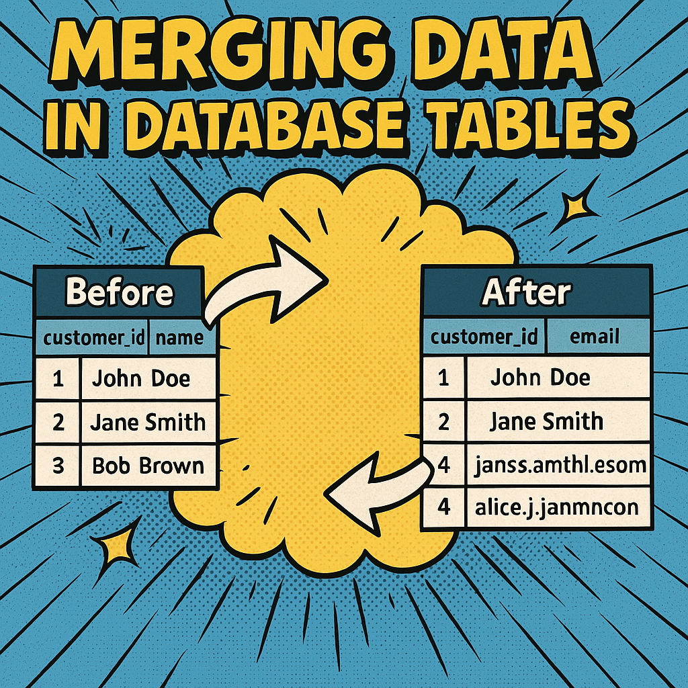





## Basic Example Scenario

Let's start with an example. Imagine you have a table called `customers` with the following columns:

- `customer_id`
- `name`
- `email`

And the following data:

| customer_id | name       | email                |
|-------------|------------|----------------------|
| 1           | John Doe   | john.doe@example.com |
| 2           | Jane Smith | xx                   |
| 3           | Bob Brown  | bobbrown@mail.com    |

You receive a new batch of data with these changes:

| customer_id | name          | email                |
|-------------|---------------|----------------------|
| 1           | John Doe      | john.doe@example.com |
| 2           | Jane Smith    | jane.smith@example.com |
| 4           | Alice Johnson | alice.j@example.com  |

Your goal is to merge this new data with the existing `customers` table. As a result of the merge operation, you want the incoming data to be integrated into the target table. This will result in one insertion of a new record (Alice Johnson), one update (email of Jane Smith), and one deletion (Bob Brown). The record for John Doe should be left untouched, as nothing has changed for this record.

Note that this example uses only a small number of rows. In real-world scenarios, you will need to deal with a very high volume of changes (e.g., up to millions per day). In the following sections, we will focus on solutions that can handle large volumes of data.

### Using a Staging Table

First, we create and insert the existing data into the `customers` table:

```sql
CREATE TABLE customers (
    customer_id INT NOT NULL PRIMARY KEY,
    name VARCHAR(100),
    email VARCHAR(100)
);

INSERT INTO customers (customer_id, name, email)
VALUES
(1, 'John Doe', 'john.doe@example.com'),
(2, 'Jane Smith', 'xx'),
(3, 'Bob Brown', 'bobbrown@mail.com');
```

To simplify this example, we currently do not take into account how we receive this data. For now, we will insert the new data into a staging table:

```sql
CREATE TABLE staging_customers (
    customer_id INT,
    name VARCHAR(100),
    email VARCHAR(100)
);

INSERT INTO staging_customers (customer_id, name, email) VALUES
(1, 'John Doe', 'john.doe@example.com'),
(2, 'Jane Smith', 'jane.smith@example.com'),
(4, 'Alice Johnson', 'alice.j@example.com');
```

### SQL Example for Inserts and Updates

You can use the `MERGE` statement to perform an Insert or Update (a.k.a. UPSERT) operation. The `MERGE` statement is supported by many databases like SQL Server, PostgreSQL, and Oracle. Note that this requires the data from your source to be loaded into a staging table first.

```sql
MERGE INTO customers AS target
USING staging_customers AS source
ON target.customer_id = source.customer_id
WHEN MATCHED THEN
    UPDATE SET name = source.name, email = source.email
WHEN NOT MATCHED THEN
    INSERT (customer_id, name, email)
    VALUES (source.customer_id, source.name, source.email);
```

Running this `MERGE` statement will automatically perform the necessary insert and update operations. Note that this process does not handle deletions. Keep in mind that the first record will be updated even if the input data matches the existing data in the destination table.

#### UPSERT Example for MySQL/MariaDB

In databases like MySQL or MariaDB that don't support the `MERGE` statement, you can use an `INSERT ... ON DUPLICATE KEY UPDATE` statement for upserts:

```sql
INSERT INTO customers (customer_id, name, email)
SELECT customer_id, name, email FROM staging_customers
ON DUPLICATE KEY UPDATE
    name = VALUES(name),
    email = VALUES(email);
```

Please note that `customer_id` is the primary key of the `customers` table. This is a prerequisite for the SQL above to work, as the primary key is automatically determined as the key column for the `ON DUPLICATE KEY` operation.

### Handling Deletes

To handle deletions, you need to identify rows that exist in the target table but not in the source. This can be achieved using a `WHERE ... NOT IN` statement.

```sql
DELETE FROM customers
WHERE customer_id NOT IN (
    SELECT customer_id FROM staging_customers
);
```

As a result, the `customers` table will now look like our input data:

| customer_id | name          | email                |
|-------------|---------------|----------------------|
| 1           | John Doe      | john.doe@example.com |
| 2           | Jane Smith    | jane.smith@example.com|
| 4           | Alice Johnson | alice.j@example.com  |


Depending on your database, there may be more elegant solutions to solve this. For some databases like SQL Server, the `MERGE` statement does support the `WHEN NOT MATCHED BY SOURCE THEN DELETE` statement, which would also include the delete operation. Or you could use a `LEFT JOIN` instead of a `WHERE ... NOT IN` to determine the records for deletions, which could result in a shorter execution time.


## Importing Data

In the previous example, we assumed that our data magically appeared in our staging table. But in real-world scenarios, we often have to deal with different kinds of data sources from which we are expected to retrieve our data. Let's examine how we can import the data into our database.

### Using `BULK INSERT` for SQL Server

Databases are often limited when importing large amounts of data. By default, most databases offer some form of CSV import. When using the database approach, you are limited to CSV files and to a specific location of the files, making it complicated if your data can't be copied onto the database server. For SQL Server, you can import CSV file data using the `BULK INSERT` statement.

Here is an example of loading a CSV file using `BULK INSERT` in SQL Server:

```sql
BULK INSERT customers
FROM '\data\customers.csv'
WITH (
    FIELDTERMINATOR = ',',
    ROWTERMINATOR = '\n'
);
```

### Data Cleansing

Besides the limitation to have data available in a CSV format, the examples above also rely on a cleansed staging table, where all data is error-free and can be merged into the destination table. The `MERGE` (or UPSERT) statements are ACID operations, meaning they are all-or-nothing: either all data is merged, or none is. If there's a flawed record in your data, the entire operation will stop, and identifying the flawed row can be challenging, as error messages typically don't specify which row(s) caused the issue.

To make this work, it is necessary that all data is cleaned before being loaded into the target table (e.g., all duplicates removed, etc.). Additionally, importing various data types (e.g., XML from a web service) can complicate the process. Therefore, it makes sense to clean and enrich the data before loading it into the staging table.

### ETL Code with C#

To load data from any source into the target table, you can use ETL data flows. ETL (Extract, Transform, Load) jobs are commonly used to clean and enrich data before loading it into the database. This approach allows you to define your own pipelines, through which your data is processed before it is written into your target table. Using an ETL approach, you can use any source and are not limited to CSV files.

A simple way to create an ETL pipeline with C# is to use the library ETLBox. Here is an example of ETLBox loading CSV data into the staging database table using `CsvSource` and `DbDestination`. After the pipeline has run, we can execute our `MERGE` statement.

#### ETL into Staging Table

When creating ETL with C#, you can load the cleansed data into the staging table and then run the `MERGE` statements, or you can directly use the `DbMerge`. Here is an example with the `MERGE` statement:

```csharp
public class CustomerRow
{
    [ColumnMap("customer_id")]
    [IdColumn]
    public int CustomerId { get; set; }

    [ColumnMap("name")]
    public string Name { get; set; }

    [ColumnMap("email")]
    public string Email { get; set; }
}

// Data flow definition
var dbConnection = new SqlConnectionManager("..connection string here...");
var source = new CsvSource<CustomerRow>("data/customers.csv");
var cleanData = new RowTransformation<CustomerRow, CustomerRow>(row => {
    row.Email = row.Email.Trim().ToLower();// Custom data cleaning logic here
    return row;
});

var staging = new DbDestination<CustomerRow>(dbConnection, "staging_customers");

// Linking & executing the data flow
source.LinkTo(cleanData);
cleanData.LinkTo(staging);

Network.Execute(source);

// Running the MERGE operation
SqlTask.Execute(dbConnection, @"
MERGE INTO customers AS target
USING staging_customers AS source
ON target.customer_id = source.customer_id
WHEN MATCHED THEN
    UPDATE SET name = source.name,
               email = source.email
WHEN NOT MATCHED THEN
    INSERT (customer_id, name, email)
    VALUES (source.customer_id, source.name, source.email);
");
```

#### ETL with DbMerge

ETLBox already has a built-in `DbMerge` feature. Here is an example of loading data from a `CsvSource`, cleaning it using custom code in a `RowTransformation`, and then merging the cleaned data using `DbMerge`:

```csharp
public class CustomerRow : MergeableRow
{
    [ColumnMap("customer_id")]
    [IdColumn]
    public int CustomerId { get; set; }

    [ColumnMap("name")]
    public string Name { get; set; }

    [ColumnMap("email")]
    public string Email { get; set; }
}

// Defining the data flow
var dbConnection = new SqlConnectionManager("..connection string here...");
var source = new CsvSource<CustomerRow>("data/customers.csv");
var cleanData = new RowTransformation<CustomerRow, CustomerRow>(row => {
    row.Email = row.Email.Trim().ToLower();// Custom data cleaning logic here
    return row;
});
var dbTypeCheck = new DbTypeCheck<CustomerRow>(dbConnection, "customers");
var merge = new DbMerge<CustomerRow>(dbConnection, "customers");
merge.BatchSize = 2000;
var typeErrors = new JsonDestination<CustomerRow>("type_errors.json");
var errorDest = new JsonDestination<ETLBoxError>("other_errors.json");

// Linking
source.LinkTo(cleanData);
cleanData.LinkTo(dbTypeCheck);
dbTypeCheck.LinkTo(merge);

// Error handling
dbTypeCheck.LinkFlawedTo(typeErrors);
merge.LinkErrorTo(errorDest);

// Executing the network
Network.Execute(source);
```

Please note that we no longer use the `MERGE` statement. The `DbTypeCheck` will verify all incoming data for compatibility with the target table before forwarding the rows to the target. Flawed rows will be written into the `type_errors.json` file. Even though we have cleaned and type-checked our data, there could still be issues when we (bulk) insert/update/delete our data in our destination. For performance reasons, this will happen in batches. Due to the ACID nature of the bulk operation, a batch can still fail - these failed batches are forwarded into `other_errors.json`. But instead of rejecting the whole batch (like in the previous `MERGE` statement), we now only reject a small batch of 2000 rows (defined in the `BatchSize` property).

#### Database Transactions

Of course, you could still spin up a database transaction for the whole operation when creating the connection:

```csharp
var dbConnection = new SqlConnectionManager("..connection string here...");
dbConnection.BeginTransaction();
```

If an error occured, you could simply call `dbConnection.Rollback()` (e.g. in a `try/catch` block) and revert your changes.

## Performance Improvements

Handling large amounts of data can make importing and merging complex. While the example provided involves only a few records, real-world scenarios often require dealing with vast amounts of data. Using a simple loop to detect each change and generate individual insert, update, or delete statements would be inefficient and result in poor performance. We need methods optimized for batch-processing large amounts of data.

Sophisticated methods such as batch processing, bulk operations, or specialized tools like ETL (Extract, Transform, Load) frameworks are necessary. These approaches handle large volumes of data efficiently by minimizing the number of database hits, grouping multiple operations into fewer transactions, and greatly enhancing performance and scalability.

### Using Smaller Batches

The merge operation on the database is powerful, but if you have, for example, 1 million rows that need to be changed in an even larger table, the merge may become too slow. In such cases, it is better to process the incoming data in smaller batches. Using an ETL approach allows us to reduce the number of rows per batch (e.g., to 10,000 or 1,000 rows per operation), which reduces the load on the database and improves performance.

### Full Load vs. Delta Load

Another important step to improve performance is to reduce the amount of data that actually needs to be loaded. When integrating data, you can either perform a full load or a delta load.

- **Full Load**: Replaces all the data in the target table with the new data. This method is simple to implement and ensures data consistency, but it can be slow and resource-intensive, especially for large datasets.

- **Delta Load**: Applies only the changes (inserts, updates, deletes) since the last load. This method is faster and less resource-intensive but more complex to implement because it requires tracking changes.

Switching from a full load to a delta load can significantly reduce the load time.

But how can a delta load be established with a data source? The following section will show examples of how this can be introduced to another database table as a data source, but similar strategies can be applied to other types of data sources as well.

#### Change Data Capture (CDC)

CDC is a technique used to identify changes in a database. It captures insert, update, and delete operations on tables and can be very useful for delta loads. When your source is a database, CDC can help by automatically tracking changes. Many databases support CDC, which can be set up to log changes in a separate table.

If you have CDC enabled on your `source_customers` table, you might have a change table like this:

| customer_id | operation | name          | email                 | change_time        |
|-------------|-----------|---------------|-----------------------|--------------------|
| 1           | U         | John Doe      | john.doe@example.com  | 2024-07-08 10:00:00|
| 2           | I         | Jane Smith    | jane.smith@example.com| 2024-07-08 10:05:00|
| 3           | D         | Alice Johnson | alice.j@example.com   | 2024-07-08 10:10:00|

- with **I** for Insert, **U** for Update and **D** for Delete.

You can use this change table to apply only the changes to your target table.

For example, we can create an ETL database source like this:

```csharp
var lastLoadDate = DateTime.Now().AddDays(-1);
var source = new DbSource<CustomerRow>() {
    ConnectionManager = dbConnection,
    TableName = "source_customers",
    Sql = "SELECT customer_id, email, name FROM source_customers WHERE change_time > @lastLoadPar",
    SqlParameter = new[] {
        new QueryParameter("lastLoadPar","DATETIME",lastLoadDate)
    }
};
```

#### Handling Non-CDC Sources

If your source does not support CDC, you need other methods to track changes. One common approach is using a **Last Modified Timestamp**. You can compare this with the last load time to identify changes.

For example, our data might look like this when including a `last_modified` column:

| customer_id | name          | email                | last_modified       |
|-------------|---------------|----------------------|---------------------|
| 1           | John Doe      | john.doe@example.com | 2024-07-08 09:00:00 |
| 2           | Jane Smith    | jane.smith@example.com| 2024-07-08 09:15:00 |
| 3           | Alice Johnson | alice.j@example.com  | 2024-07-08 09:20:00 |

You can now select rows where `last_modified` is greater than the last load time to get the changes.

### Truncate Target Table

In scenarios where you want to do a full load but have a large number of changes, it may be faster to truncate the target table first and then replace it with all data from the source. This approach can significantly reduce the time and resources needed to update the table.

Here is an example using ETLBox to truncate a table and reload data:

```csharp
// Define the connection manager
var dbConnection = new SqlConnectionManager("..connection string here...");

// Truncate the target table
TruncateTableTask.Truncate(dbConnection, "customers");

// Define the data flow
var source = new CsvSource<CustomerRow>("data/customers.csv");
var cleanData = new RowTransformation<CustomerRow, CustomerRow>(row => {
    // Custom data cleaning logic here
    return row;
});
var destination = new DbDestination<CustomerRow>(dbConnection, "customers");

// Linking & executing the data flow
source.LinkTo(cleanData);
cleanData.LinkTo(destination);

Network.Execute(source);
```

#### Removing and Adding Indexes and Constraints

Additionally, it could be time-saving to remove any indexes / statistics / unique key constraints from the table before the insert operation, and then re-adding them after all data has been copied.

## Enhancing the DbMerge

The built-in `DbMerge` of ETLBox supports various performance scenarios out of the box.

### Using Delta with DbMerge

Both full and delta loads are supported by the DbMerge component of ETLBox. The following MergeModes are supported:

- Delta: Does inserts and updates, deletions only with a flag
- Full: Does inserts, updates, and deletions (deletions if the record is missing)
- InsertsAndUpdatesOnly: Does inserts and updates only
- UpdatesOnly: Only updates, no inserts or deletions

In the ETL code, you can adjust your data transfer class using different attributes to describe your id, update, and compare columns. For delta loads, you can also specify an attribute to indicate when a column should be deleted.

Here is an example setup of a data transfer class, that also uses the `DeleteColumn` attribute:

```csharp
public class CustomerRow
{
    [ColumnMap("customer_id")]
    [IdColumn]
    public int CustomerId { get; set; }

    [ColumnMap("name")]
    [CompareColumn]
    [UpdateColumn]
    public string Name { get; set; }

    [UpdateColumn]
    [ColumnMap("email")]
    public string Email { get; set; }

    [DeleteColumn(true)]
    public bool IsDeletion { get;set; }
}
```

### Cache Mode

By default, DbMerge will always load all data from the destination into memory first. If you want to avoid this, for example, because your target table is quite large, consider setting the CacheMode to `CacheMode.Partial`.

Setting the cache mode to partial will only load the data into memory for the currently processed batch. All other data will be removed from the cache. You can choose from different eviction policies that control how data is removed from the cache when it reaches its maximum size:

- Least Recently Used (LRU): Evicts the least recently accessed items from the cache.
- Least Frequently Used (LFU): Evicts the least frequently accessed items from the cache.
- First In First Out (FIFO): Evicts the oldest items in the cache first.
- Last In First Out (LIFO): Evicts the most recently added items first.

```csharp
DbMerge<MyMergeRow> merge = new DbMerge<MyMergeRow>(connection, "DestinationTable");
merge.CacheMode = CacheMode.Partial;
merge.EvictionPolicy = CacheEvictionPolicy.LeastRecentlyUsed;
```

### Truncating Target

Additionally, `DbMerge` has a setting `UseTruncateMethod = true`, which allows it to load the data into memory first, then truncate the table, and then insert the data while still detecting the changes. This method combines the benefits of truncating the table with the ability to track changes.

```csharp
var merge = new DbMerge<CustomerRow>(dbConnection, "customers") {
    BatchSize = 2000,
    UseTruncateMethod = true
};
```

In this example, `DbMerge` collects merge information and sends it to another table (`merge_info_table`). The `UseTruncateMethod` setting ensures that data is loaded into memory, the target table is truncated, and then the data is inserted, improving performance while still detecting changes.

### Delta Table

The `DbMerge` has a property `DeltaTable` which is a list containing information about what records were updated, inserted, or deleted. The operation and change date are stored in the corresponding `ChangeDate` and `ChangeAction` properties.

For example, the `merge_info_table` could have the following structure:

```sql
CREATE TABLE merge_info_table (
    customer_id INT,
    operation CHAR(1),
    change_time DATETIME
);
```

This table will store the `customer_id` of the affected rows, the type of operation (Insert, Update, or Delete), and the timestamp of the change.

This delta table can be accessed if the `DbMerge` is not treated as a source but as a transformation. If the `DbMerge` is linked to other components, it will write the delta records into its output.

In this example, you can send the delta information further down in the data flow, for example, to another database table.

```csharp
// Define the connection manager
var dbConnection = new SqlConnectionManager("..connection string here...");
// Define the data flow
var source = new CsvSource<CustomerRow>("data/customers.csv");
var dbTypeCheck = new DbTypeCheck<CustomerRow>(dbConnection, "customers");
var merge = new DbMerge<CustomerRow>(dbConnection, "customers") {
    BatchSize = 2000,
    CacheMode = CacheMode.Partial,
    EvictionPolicy = CacheEvictionPolicy.LeastRecentlyUsed,
    MergeMode = MergeMode.Full
};
var mergeInfo = new DbDestination<MergeInfoRow>("merge_info_table", dbConnection);

// Linking
source.LinkTo(dbTypeCheck);
dbTypeCheck.LinkTo(merge);

// Collecting merge information
merge.LinkTo(mergeInfo);

// Executing the network
Network.Execute(source);
```


## Going Further: Building Dynamic Data Flows

The above examples for the `DbMerge` make use of strongly typed objects (POCOs). However, the `DbMerge` also supports the use of the dynamic `ExpandoObject`. When using the `ExpandoObject`, you don't have to create a strongly typed object beforehand. The corresponding properties are created on-the-fly whenever a value is assigned.

This feature is very powerful. Imagine you want to write integration code for hundreds of tables, perhaps even from different sources. Using the dynamic object approach lets you easily write a data flow that can handle different tables and data types without needing to define a separate POCO for each table. The target table could also be created dynamically if needed.

### Example Use Case

Consider a scenario where you need to integrate data from two different CSV files, each representing a different entity (customers and orders), but having an overlapping property (`eMail`) that should be cleaned the same way. Instead of defining a POCO for each entity, you can use `ExpandoObject` to dynamically handle the data.

```csharp
using System.Dynamic;
using ETLBox.DataFlow;
using ETLBox.Connection;

// Define the connection manager
void RunMerge(string entity) {
    var dbConnection = new SqlConnectionManager("..connection string here...");
    var source = new CsvSource<ExpandoObject>($"data/{entity}.csv");

    // Data transformation
    var cleanData = new RowTransformation<ExpandoObject, ExpandoObject>(row => {
        // Data cleaning logic for both entities
        dynamic dynamicRow = row;
        dynamicRow.eMail = dynamicRow.eMail?.Trim().ToLower();
        return dynamicRow;
    });

    // Define DbMerge dynamically
    var merge = new DbMerge<ExpandoObject>() {
        ConnectionManager = dbConnection,
        TableName = entity + "s",
        BatchSize = 2000,
        MergeMode = MergeMode.Full
    };

    // Linking and executing the data flow
    source.LinkTo(cleanData);
    cleanData.LinkTo(merge);
    Network.Execute(source);
}
```

You could further enhance the dynamic nature of your data flow by creating target tables on the fly based on the schema of the incoming data. This can be particularly useful in scenarios where the schema is not known beforehand. An introduction to creating dynamic data flows like this will be part of another article.

## Conclusion

Merging data is a key skill that helps keep your business information accurate and useful. Whether you're working with a few records or millions of them, using the right methods can save time, reduce mistakes, and make your processes smoother. Tools like ETLBox can make this even easier by helping you clean, transform, and load your data quickly and efficiently. By using these techniques and tools, you can ensure your data is always up-to-date and your business stays ahead in the data-driven world.


