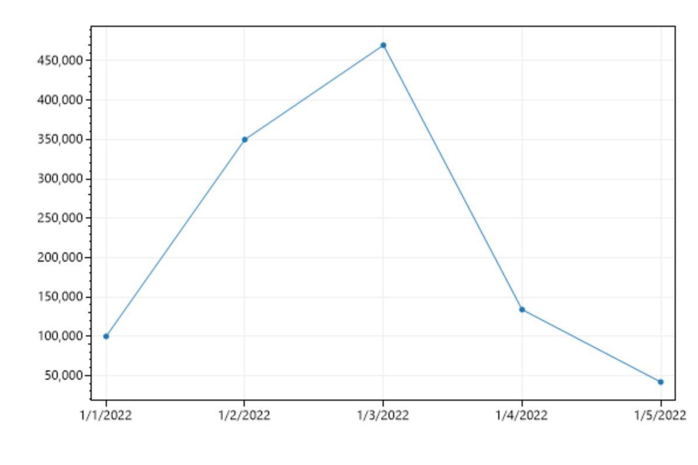

### C# and Polyglot Notebooks

C# is a powerful programming language widely used for building a variety of applications, from web apps to complex data processing systems. Polyglot notebooks, like Jupyter notebooks, allow you to write and execute code in multiple programming languages within the same document. This makes it easier to share and collaborate on projects, especially those involving data analysis, visualization, or machine learning.

Traditionally, C# hasn't been as common in the realm of polyglot notebooks, which have been more associated with languages like Python and R. However, Microsoft has made significant improvements in recent years, making it much easier to use C# within these environments. With these advancements, we can now leverage the full power of C# for tasks that require high performance and robust tooling.

### The Use-case of ETL in a Polyglot Notebook

ETL stands for Extract, Transform, Load, and it's a process commonly used in data management to move data from one place to another, transform it into a usable format, and then load it into a database or another storage system. In polyglot notebooks, basic tasks like loading data from a CSV file are supported out-of-the-box. However, when dealing with more complex data sources such as databases or web APIs, and then transforming this data, ETL pipelines become indispensable.

We are using ETLBox, a library designed for ETL processes in .NET environments, because it allows us to write ETL code in C#. By using a polyglot notebook, we can combine the flexibility of different programming languages with the power of C# for data manipulation.

### How to Create Your Own Polyglot Notebook

To create your own polyglot notebook in VS Code, follow these steps:

1. **Prerequisites**: Make sure you have Visual Studio Code (VS Code) installed on your computer. You will also need to install the Polyglot Notebooks extension to enable multi-language support within your notebook.

2. **Press** `CTRL + SHIFT + P` **to open the command dialogue**.

3. **Select** `Polyglot Notebook: Create Default Notebook`.

4. **Choose the** `.ipynb` **extension and select the** `C#` **language**.

5. **Add the following code blocks** to start coding in C#:

   ```csharp
   // This is where your C# code will go
   var s = "Hello, Polyglot Notebook!";
   s
   ```

   (Note the missing `;` at the end of the last line)

6. **Run the code**: This should print `Hello, Polyglot Notebook!` as output.

These steps will set up a fresh new notebook where you can start exploring using Polyglot Notebooks with C#.

### Setting Up a Database Table for ETL Using C# in a Polyglot Notebook

Let's see how to set up a simple database table using C# within a polyglot notebook.

1. **Install ETLBox.SqlServer Package**

   Before we begin, ensure you have the ETLBox.SqlServer package installed. This package provides the necessary tools to interact with SQL Server databases using ETLBox.

   ```csharp
   #r "nuget:ETLBox.SqlServer, 3.4.0"
   ```

2. **Set Up Connection Credentials**

   ```csharp
   using ETLBox;
   using ETLBox.SqlServer;
   using ETLBox.ControlFlow;

   IConnectionManager connMan = new SqlConnectionManager("Data Source=localhost;User Id=sa;Password=YourStrong@Passw0rd;Initial Catalog=demo;TrustServerCertificate=true;");
   ```

   Replace the connection string in the code below with your SQL Server credentials. This example assumes you are connecting to a local SQL Server instance (`localhost`), using the `sa` user with the password `YourStrong@Passw0rd`, and targeting a database named `demo`.

3. **Define Table Structure**

   We'll define a simple table named `Test` with three columns: `Id` (INT, identity column), `XValue` (DATETIME), and `YValue` (INT). This table will store sample data for demonstration purposes.

   ```csharp
   var def = new TableDefinition("Test", new List<TableColumn>() {
       new TableColumn("Id", "INT", allowNulls: false, isIdentity:true, isPrimaryKey:true),
       new TableColumn("XValue", "DATETIME", allowNulls: false),
       new TableColumn("YValue", "INT", allowNulls: false)
   });
   ```

4. **Create the Table**

   Before creating the table, ensure any existing table with the same name is dropped to start fresh. This step is handled by the `DropTableTask.DropIfExists` method.

   ```csharp
   DropTableTask.DropIfExists(connMan, "Test");
   CreateTableTask.CreateIfNotExists(connMan, def);
   ```

5. **Insert Sample Data**

   Populate the `Test` table with sample data using SQL INSERT statements.

   ```csharp
   SqlTask.ExecuteNonQuery(connMan, "INSERT INTO Test VALUES('2022-01-01',100)");
   SqlTask.ExecuteNonQuery(connMan, "INSERT INTO Test VALUES('2022-01-02',350)");
   SqlTask.ExecuteNonQuery(connMan, "INSERT INTO Test VALUES('2022-01-03',470)");
   SqlTask.ExecuteNonQuery(connMan, "INSERT INTO Test VALUES('2022-01-04',134)");
   SqlTask.ExecuteNonQuery(connMan, "INSERT INTO Test VALUES('2022-01-05',42)");
   ```

6. **Execute the code**

   After executing the code, check your SQL Server database (`demo` in this example) to verify that the `Test` table has been created and populated with the sample data.


## Loading Data using an ETL Pipeline

Let's see how to load data from a SQL Server database into memory and analyze it using DataFrames in a polyglot notebook environment.

1. **Setup Environment**

   Ensure you have the necessary libraries installed and configured. We are using ETLBox for ETL operations, including data extraction from SQL Server, and Microsoft's DataFrame for data analysis.

   ```C#
   #r "nuget:ETLBox, 3.4.0"
   #r "nuget:ETLBox.SqlServer, 3.4.0"
   #r "nuget:ETLBox.Analysis, 3.4.0"

   using ETLBox;
   using ETLBox.ControlFlow;
   using ETLBox.SqlServer;
   using ETLBox.DataFlow;
   using ETLBox.Analysis;
   ```

2. **Loading Data from Database**

   Initialize the connection manager and define a `DbSource` to extract data from the `Test` table in our SQL Server database.

   ```csharp
   //The connMan was already defined in a previous step!
   //IConnectionManager connMan = new SqlConnectionManager("Data Source=localhost;User Id=sa;Password=YourStrong@Passw0rd;Initial Catalog=demo;TrustServerCertificate=true;");
   var source = new DbSource(connMan, "Test");
   ```

3. **Transforming Data**

   Use a `RowTransformation` to manipulate the data in memory. In this example, we multiply the `YValue` column by 1000.

   ```csharp
   var row = new RowTransformation(row => {
       dynamic r = row as dynamic;
       r.YValue = r.YValue * 1000;
       return row;
   });
   ```

4. **Multicasting Data**

   Utilize a `Multicast` component to split the data flow into two branches:
   - One branch feeds data into a `MemoryDestination`, storing data in a C# List (`memDest.Data`).
   - The other branch stores data into a `DataFrameDestination`, creating a DataFrame (`dfDest.DataFrame`) for further analysis.

   ```csharp
   var multicast = new Multicast();
   var memDest = new MemoryDestination();
   var dfDest = new DataFrameDestination();
   multicast.OnProgress = pc => Console.WriteLine($"Records loaded from database: {pc}");

5. **Running the Pipeline**

   Until now, we've defined our pipeline components. Now, let's link them together and trigger the data flow.

   ```C#
   source.LinkTo(row);
   row.LinkTo(multicast);
   multicast.LinkTo(memDest);
   multicast.LinkTo(dfDest);

   Network.Execute(source);
   ```

5. **Accessing Loaded Data**

   We stored the data loaded into the `MemoryDestination` (`memDest.Data`) and the DataFrame from `DataFrameDestination` (`dfDest.DataFrame`) for further analysis and manipulation in variables in our notebook.

   ```csharp
   var data = memDest.Data; // This is a List<object[]>
   var df = dfDest.DataFrame; // This is a Microsoft.Analysis.DataFrame object
   ```

## Displaying and Analyzing Data

Let's see how we can display and analyze the data loaded into tjhe polyglot notebook.

### Displaying the DataFrame

To begin with, let's display the contents of the DataFrame (`df`). This DataFrame contains the transformed data from our ETL pipeline.

```csharp
// Displaying the DataFrame
df
```

We will get an output like this:

index|Id|XValue|YValue
-----|--|------|------
0|1|2022-01-01 00:00:00Z|100000
1|2|2022-01-02 00:00:00Z|350000
2|3|2022-01-03 00:00:00Z|470000
3|4|2022-01-04 00:00:00Z|134000
4|5|2022-01-05 00:00:00Z|42000


### Transforming the DataFrame

We can perform additional transformations directly on the DataFrame. In this example, we'll create a new column `x` by doubling the values in the `YValue` column.

```csharp
// Transforming the DataFrame
df["x"] = df["YValue"] * 2;
df
```

Now our output becomes this:

index|Id|XValue|YValue
-----|--|------|------
0|1|2022-01-01 00:00:00Z|100000|200000
1|2|2022-01-02 00:00:00Z|350000|700000
2|3|2022-01-03 00:00:00Z|470000|940000
3|4|2022-01-04 00:00:00Z|134000|268000
4|5|2022-01-05 00:00:00Z|42000|84000

The `Microsoft.Analysis.DataFrame` is highly effective as an in-memory structure for data analysis and querying.

You can learn more about it here in the Microsft Documentation: 

### Visualizing Data with ScottPlot

Next, we'll visualize the loaded data using ScottPlot, 

```csharp
#r "nuget:ScottPlot, 4.1.69"

using Microsoft.DotNet.Interactive.Formatting;

// Setup a custom formatter to display plots as images
Formatter.Register(typeof(ScottPlot.Plot), (plot, writer) =>
    writer.Write(((ScottPlot.Plot)plot).GetImageHtml()), HtmlFormatter.MimeType);

var plt = new ScottPlot.Plot(600, 400);

// Extract data from memDest.Data for plotting
var dataX = memDest.Data.Select(row => (DateTime)(row as dynamic).XValue)
                        .Select(dt => dt.ToOADate()).ToArray();
var dataY = memDest.Data.Select(row => (double)(row as dynamic).YValue).ToArray();

// Add scatter plot to ScottPlot
plt.XAxis.DateTimeFormat(true); // Enable DateTime formatting on X-axis if applicable
plt.AddScatter(dataX, dataY);

plt
```

This will print out our data as a plot:



## Final Thoughts

Using C# in polyglot notebooks allows data professionals to work without needing to learn a new programming language. Polyglot notebooks enable users to use their existing knowledge about C# and the .NET framework in one environment, enhanced by the power of Jupyter notebooks.

By default, loading data using existing data frameworks only support loading basic files (like CSV). This  makes the inclusion of ETL processes in notebooks essential for managing more complex data tasks. ETLBox, tailored for C#, stands out as the best framework designed specifically for this purpose.

Together, C#, Polyglot notebooks and ETLBox simplify data processing, supporting data professional to work more efficiently and make better decisions based on their data.

### Code on Github

The notebook code for this example .
