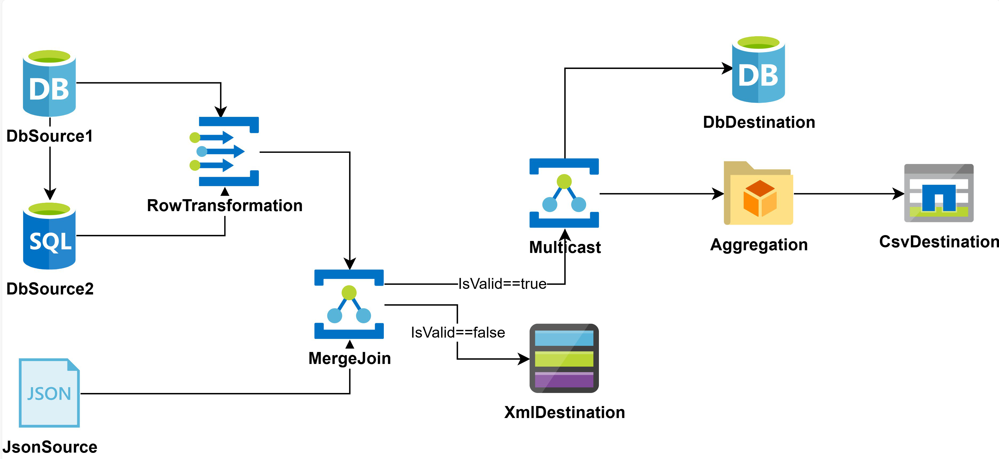

## Basic Linking

Here’s an example of linking a `CsvSource` to a `RowTransformation` and then to a `MemoryDestination`:

```csharp
// Create components
CsvSource source = new CsvSource("data.csv");
RowTransformation rowTrans = new RowTransformation(row => row);
MemoryDestination dest = new MemoryDestination();

// Link components
source.LinkTo(rowTrans);
rowTrans.LinkTo(dest);

public class MyRow {
    public int Id { get; set; }
    public string Value { get; set; }
}
```

This creates a flow:

```kroki {type=mermaid}
%%{init: {'theme':'neutral'}}%%
flowchart LR
  source[CsvSource] --> transformation(RowTransformation)
  transformation --> destination[MemoryDestination]
```

Your source file might look like this:

```csv
Id,Value
0,-
1,A
2,B
-1,C
```

### Fluent Notation

You can write the same flow with fewer lines using fluent notation:

```csharp
source.LinkTo(rowTrans).LinkTo(dest);
```

**Note:** This works in most cases, except for components with multiple inputs/outputs like `Multicast` or `MergeJoin`.

If your transformation changes the data type, adjust the linking like this:

```csharp
source.LinkTo<OutputType>(rowTrans).LinkTo(dest);
```

This would be the fluent notation if we used a `RowTransformation<ExpandObject, OutputType> row` in our example.

### Using Predicates for Conditional Linking

You can add filter expressions (predicates) to links. Predicates evaluate each row, directing data to specific components based on conditions.

```csharp
CsvSource<MyRow> source = new CsvSource<MyRow>("data.csv");
MemoryDestination<MyRow> destA = new MemoryDestination<MyRow>();
MemoryDestination<MyRow> destB = new MemoryDestination<MyRow>();
MemoryDestination<MyRow> destOther = new MemoryDestination<MyRow>();

source.LinkTo(destA, row => row.Value == "A");
source.LinkTo(destB, row => row.Value == "B");
source.LinkTo(destOther, row => row.Value != "A" && row.Value != "B");
```

Data is sent to the first link whose predicate evaluates to true. To duplicate data, use [Multicast](/docs/transformations/multicast).


Ensure all data reaches a destination; otherwise, your data flow may hang waiting for all records to be processed.


### VoidDestination: Ignoring Data in ETLBox

When you have data that doesn't need further processing, use `VoidDestination` to ensure your flow completes properly:

```csharp
CsvSource<MyRow> source = new CsvSource<MyRow>("data.csv");
VoidDestination<MyRow> voidDest = new VoidDestination<MyRow>();
source.LinkTo(dest, row => row.Id > 0);
source.LinkTo(voidDest, row => row.Id <= 0);
```

This ignores rows where `Id <= 0`.

### Filtering Data with FilterTransformation

The `FilterTransformation` component in ETLBox filters rows in your data flow based on a condition defined by a predicate. The predicate is a function that returns `true` for rows that should pass through and `false` for rows that should be discarded.

Example usage:

```csharp
var source = new CsvSource<MyRow>("data.csv");

var filter = new FilterTransformation<MyRow>();
filter.FilterPredicate = row => row.Id > 0;

var dest = new MemoryDestination<MyRow>();

source.LinkTo(filter).LinkTo(dest);
Network.Execute(source);

foreach (var row in dest.Data)
    Console.WriteLine($"Id:{row.Id}, Value:{row.Value}");
```

In this example, only rows with an `Id` greater than zero will pass through the filter and be written to the destination. You can use `FilterTransformation` when you need to filter data based on specific conditions within your pipeline. Alternatively, filtering can also be done directly during the linking of components using predicates.

### Splitting Data with ConditionalSplit

The `ConditionalSplit` transformation allows you to direct rows to different outputs based on a condition. You define a `MatchPredicate` that evaluates each row. Rows that meet the condition are sent to one output, and rows that don't can be optionally routed to another output using `LinkUnmatchedTo`.

Example usage:

```csharp
var source = new CsvSource<MyRow>("data.csv");
var split = new ConditionalSplit<MyRow>();
split.MatchPredicate = row => row.Id > 1;
var validIds = new MemoryDestination<MyRow>();
var invalidIds = new MemoryDestination<MyRow>();

source.LinkTo(split);
split.LinkTo(validIds);
split.LinkUnmatchedTo(invalidIds);

Network.Execute(source);

foreach (var row in validIds.Data)
    Console.WriteLine($"Valid: {row.Id}, {row.Value}");
foreach (var row in invalidIds.Data)
    Console.WriteLine($"Below: {row.Id}, {row.Value}");
```

This transformation helps you split data streams dynamically based on conditions, ensuring that each subset of data is processed or stored appropriately.

#### Implicit VoidDestination

You can also let ETLBox handle it implicitly:

```csharp
source.LinkTo(dest, row => row.Id > 0, row => row.Id <= 0);
```

## Handling Errors in Data Flows

Exceptions in ETLBox bubble up by default, faulting the component and canceling the flow. Consider the following example:

```csharp
CsvSource<MyRow> source = new CsvSource<MyRow>("test.csv");
RowTransformation<MyRow> rowTrans = new RowTransformation<MyRow>();
rowTrans.TransformationFunc = row => {
    if (row.Id <= 0)
        throw new ArgumentException("Id must have a value > 0!");
    else
        return row;
};
MemoryDestination<MyRow> dest = new MemoryDestination<MyRow>();

source.LinkTo(rowTrans).LinkTo(dest);
try {
    Network.Execute(source); //<-- the exception will be rethrown here!
} catch(Exception e) {
    Console.WriteLine(e.Message);
}
```

In this example, an exception is thrown when the `Id` is less than or equal to 0. Once thrown, the entire data flow is canceled, with the component that raised the error being faulted.


Each ETLBox component has an `Exception` property. If a component throws an exception, a reference to it is stored in this property for later inspection.


If your data flow runs asynchronously, exceptions may be wrapped in an `AggregateException`.

### Redirecting Errors

ETLBox allows you to handle errors gracefully by redirecting faulty records to an error output. Use `LinkErrorTo` to send erroneous records to a separate component. We can now extend our previous example:

```csharp
CsvSource<MyRow> source = new CsvSource<MyRow>("test.csv");
RowTransformation<MyRow> rowTrans = new RowTransformation<MyRow>();
rowTrans.TransformationFunc = row => {
    if (row.Id <= 0)
        throw new ArgumentException("Id must have a value > 0!");
    else
        return row;
};
MemoryDestination<MyRow> dest = new MemoryDestination<MyRow>();

CsvDestination<ETLBoxError> errorDest = new CsvDestination<ETLBoxError>("error.csv");

source.LinkTo(rowTrans).LinkTo(dest);

rowTrans.LinkErrorTo(errorDest);

Network.Execute(source); //<-- no exception will be thrown
```

`ETLBoxError` stores details about the exception, including the error message, timestamp, exception type, and a JSON representation of the record:

| ErrorText | ReportTime | ExceptionType | RecordAsJson |
|-----------|------------|---------------|--------------|
| Id must be > 0! | 2021-03-26 | ArgumentException | {"Id":0,"Value":"-"} |

This approach ensures that your data flow continues processing even when errors occur, while also logging error details for later analysis. You may choose any type of destination, or you can even define a complete new pipeline for advanced error processing.

This would be the content  of the error file when running the example data flow from before, now with linking errors into a `CsvDestination`:

```csv
ErrorText,ReportTime,ExceptionType,RecordAsJson
Id must have a value > 0!,2021-03-26 14:41:26.952,System.ArgumentException,"{""Id"":0,""Value"":""-""}"
Id must have a value > 0!,2021-03-26 14:41:27.679,System.ArgumentException,"{""Id"":-1,""Value"":""C""}"
```


## Multiple Inputs & Outputs

ETLBox allows you to build complex networks with multiple inputs and outputs. You can link sources and transformations to several components simultaneously, enabling data joins, splits, and broadcasts.

Here’s an example of a more complex flow:



This code snippet demonstrates how multiple components can be linked:

```csharp
dbSource1.LinkTo(rowTransformation);
dbSource2.LinkTo(rowTransformation);
rowTransformation.LinkTo(mergeJoin);
jsonSource.LinkTo(mergeJoin);
mergeJoin.LinkTo(multicast, row => row.IsValid == true);
mergeJoin.LinkTo(xmlDestination, row => row.IsValid == false);
multicast.LinkTo(dbDestination);
multicast.LinkTo(aggregation);
aggregation.LinkTo(csvDestination);
```

This example highlights the flexibility ETLBox offers for creating intricate data pipelines, including merging data from different sources, broadcasting to multiple destinations, and applying conditional logic during the flow.


With normal predicates, you can only split your data. To merge data streams, use the `MergeJoin` component. For broadcasting the same data to multiple outputs, use the `Multicast` component."


### Merging Data with MergeJoin

The `MergeJoin` transformation allows you to combine data from two input sources based on a matching condition. It supports both simple joins (without comparison logic) and advanced joins where you define how rows are compared.

**Example**:

```csharp
var source1 = new MemorySource<MyLeftRow>();
source1.DataAsList.Add(new MyLeftRow() { FirstName = "Elvis" });
source1.DataAsList.Add(new MyLeftRow() { FirstName = "Marilyn" });

var source2 = new MemorySource<MyRightRow>();
source2.DataAsList.Add(new MyRightRow() { LastName = "Presley" });
source2.DataAsList.Add(new MyRightRow() { LastName = "Monroe" });

var join = new MergeJoin<MyLeftRow, MyRightRow, MyOutputRow>(
    (left, right) => new MyOutputRow { FullName = left.FirstName + " " + right.LastName }
);

var dest = new MemoryDestination<MyOutputRow>();

source1.LinkTo(join.LeftInput);
source2.LinkTo(join.RightInput);
join.LinkTo(dest);
Network.Execute(source1, source2);

foreach (var row in dest.Data)
    Console.WriteLine(row.FullName);
// Output: Elvis Presley, Marilyn Monroe
```

This component is especially useful when combining data from different sources that share a common key.

### Broadcasting Data with Multicast

The `Multicast` transformation replicates data from one source to multiple destinations. Each output receives the same data, enabling broadcasting the same data to different destinations.

**Example**:

```csharp
var source = new MemorySource<MyRow>();
source.DataAsList.Add(new MyRow() { Id = 1, Value = "A" });
source.DataAsList.Add(new MyRow() { Id = 2, Value = "B" });

var dest1 = new MemoryDestination<MyRow>();
var dest2 = new MemoryDestination<MyRow>();

var multicast = new Multicast<MyRow>();

source.LinkTo(multicast);
multicast.LinkTo(dest1);
multicast.LinkTo(dest2);

Network.Execute(source);
```

In this example, both `dest1` and `dest2` receive identical copies of the data from `source`.

