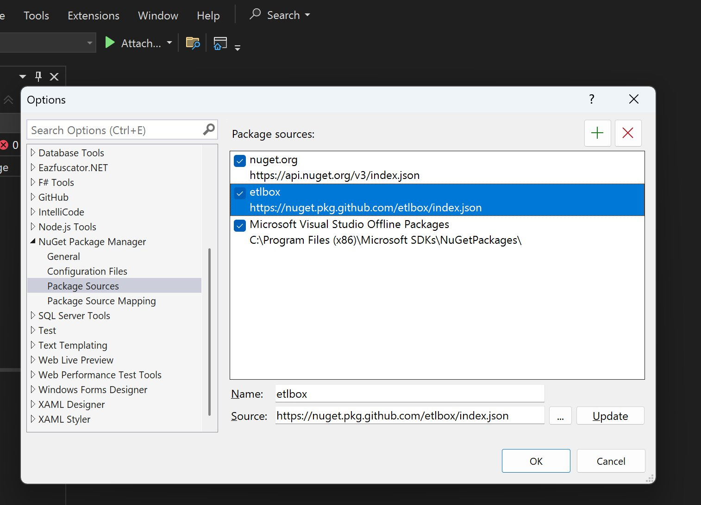

## License File Overview

When you purchase a license, you’ll receive a license file, typically named `etlbox.lic`. This file is encoded in UTF-8 and can be opened with any text editor. It’s human-readable and contains encrypted license information.

**Sample License File Content:**

```text
2010-01-01|COMPANY: 3DEVS|ANNUAL:2010-01-01|SUPPORT:STANDARD|CUSTOMER:ETLBoxperts GmbH|MAIL:support@etlbox.net||oPuwE+8bnjgELq1bJCf3PG5VRW9iY81ICgRZoRddVwd9FuEFSYddrz6PmP1u4g2QSQ+0hqvC/VRTm4ZgUJsJYqEOvr0tfYcL9l9enH1DgdTG5bInSLc7+C+vTxRbpHYn5Pz05YUA3IWqtv6LRfiakQlTxl8NYwUhgL249Q9x3Co=
```

## Register Your License Key

You can register your ETLBox license key in three different ways. Choose the method that best fits your environment.

### Option 1 - Programmatically (Recommended)

This is the preferred method, as it works in all environments.

- Open the `etlbox.lic` file with a text editor.
- Copy the entire content of the file.
- Add the following code to your project before executing any DataFlow:




```C#
using ETLBox.Licensing;
LicenseService.CurrentKey = "content_of_license_file";
```


```C#
using ETLBoxOffice.LicenseManager;
LicenseCheck.LicenseKey = "content_of_license_file";
```




Make sure this line is executed before any ETL operations start.



### Option 2 - Environment Variable

You can set the license key as an environment variable, which works across different systems and deployment environments.

- Set an environment variable named `etlbox`.
- Copy the content of your `etlbox.lic` file as the value of this variable.
- Restart your system or application if necessary.

#### Using Azure Functions or Azure Web Apps:

- Go to Configuration → App Settings in your Azure Function or Web App settings.
- Add a new setting:
  - Name: `etlbox`
  - Value: Paste the content of your `etlbox.lic` file.



### Option 3 - File-Based

You can place the `etlbox.lic` file directly alongside the ETLBox DLL.

- Copy `etlbox.lic` to the same folder as ETLBox.dll (usually the root of your project).

#### Visual Studio Projects

If you’re adding the license file to your project in Visual Studio, and you want to make sure that it is automatically copied into your output folder:

1. Right-click on `etlbox.lic` in **Solution Explorer**.
2. Select **Properties**.
3. Set **Copy to Output Directory** to either:
   - **Copy always**, or
   - **Copy if newer**.


#### Project File Configuration

If you prefer to edit the project file (`.csproj`) directly, add the following entry:

```xml
<ItemGroup>
  <None Update="etlbox.lic">
    <CopyToOutputDirectory>Always</CopyToOutputDirectory>
  </None>
</ItemGroup>
```

#### For Azure Functions / Web Apps:

- With File System Access:
  Deploy the `etlbox.lic` file to the same folder as your application files.

- Using Zip Deploy (No File System Access):
  - Add `etlbox.lic` as an embedded resource in your project.
  - ETLBox will automatically detect the license from the embedded resource during runtime.

## Troubleshooting License Issues

- Ensure the license key is registered before any ETL operations start.
- Double-check that the key or file content hasn’t been altered.
- For environment variables, restart your system or application after setting them.
- If using Azure, verify that the app settings are correctly applied.
- Still having issues? [Contact ETLBox Support for assistance](/support/options).


## Accessing the License-Free Package Feed

If you have purchased the license-free package access, you can retrieve ETLBox from our private GitHub NuGet package feed. This feed contains only the core ETLBox package, while database-specific extensions (e.g., `ETLBox.SqlServer`, `ETLBox.Postgres`) remain available via NuGet.org. The license check is enforced only in the core package—once referenced in your project, the restriction is removed, allowing you to use all other ETLBox packages from NuGet.org as usual.

### Adding the GitHub Package Source

You can access the GitHub package feed by adding the following package source:

```
https://nuget.pkg.github.com/etlbox/index.json
```

There are two ways to configure this:

#### Option 1 - Using Visual Studio

1. Open **Visual Studio**.
2. Navigate to **Tools** → **NuGet Package Manager** → **Package Manager Settings**.
3. In the left panel, select **Package Sources**.
4. Click the green **+** icon in the top right corner.
5. Enter:
   - **Name**: etlbox
   - **Source**: `https://nuget.pkg.github.com/etlbox/index.json`
6. Click **Update** and ensure the feed is enabled.



#### Option 2 - Command Line (NuGet CLI)

You can also add the package source using the NuGet CLI:



```cmd
dotnet nuget add source "https://nuget.pkg.github.com/etlbox/index.json" --name "etlbox"
```


```ps1
PM> Register-PackageSource -Name "etlbox" -Location "https://nuget.pkg.github.com/etlbox/index.json" -ProviderName NuGet
```

This command is intended to be used within the Package Manager Console in Visual Studio.





#### Where is this Configuration Stored?

On Windows, NuGet sources are stored in:

```
%APPDATA%\NuGet\NuGet.Config
```

On Linux/macOS:

```
~/.nuget/NuGet/NuGet.Config
```

This file contains XML entries defining the configured package sources. If needed, you can manually edit it to add the GitHub feed:

```xml
<configuration>
  <packageSources>
    <add key="ETLBox GitHub Feed" value="https://nuget.pkg.github.com/etlbox/index.json" />
  </packageSources>
</configuration>
```

### Authentication for the GitHub Package Feed

When adding the GitHub NuGet package source, you will be prompted to authenticate. To access the feed, you need to use a Personal Access Token (classic) as your password.

#### Generating a Personal Access Token (classic)

1. Go to .
2. Click **Generate new token (classic)**.
3. Select an **expiration date**.
4. Under **Scopes**, enable:
   - `read:packages` (allows access to NuGet packages).
5. Click **Generate token** and **copy** it immediately — GitHub won’t show it again.

For detailed steps, refer to .

#### Storing the Access Token

When prompted in Visual Studio or the CLI, use:

- **Username**: Your GitHub username
- **Password**: Your Personal Access Token (PAT)

By default, Visual Studio and the NuGet CLI store your credentials in the Windows Credential Manager or the system keychain:

- **Windows:** `Credential Manager` (search in Start Menu → "Manage Windows Credentials").
- **Mac/Linux:** Stored in `~/.nuget/NuGet/NuGet.Config` or the OS keychain.

If you want to store credentials manually in NuGet, run:

```sh
dotnet nuget add source "https://nuget.pkg.github.com/etlbox/index.json" -name "etlbox" --username YOUR_GITHUB_USERNAME --password YOUR_PERSONAL_ACCESS_TOKEN --store-password-in-clear-text
```

For further details, see .

### Understanding Versioning for License-Free Packages

To avoid conflicts when using both NuGet.org and GitHub package feeds, the license-free versions in the GitHub feed always have an additional `.1` at the end.

For example:
- If the official ETLBox version on NuGet.org is `3.7.3`,
- The corresponding GitHub feed version will be `3.7.3.1`.

This ensures that you can install both feeds without versioning conflicts in your project.
