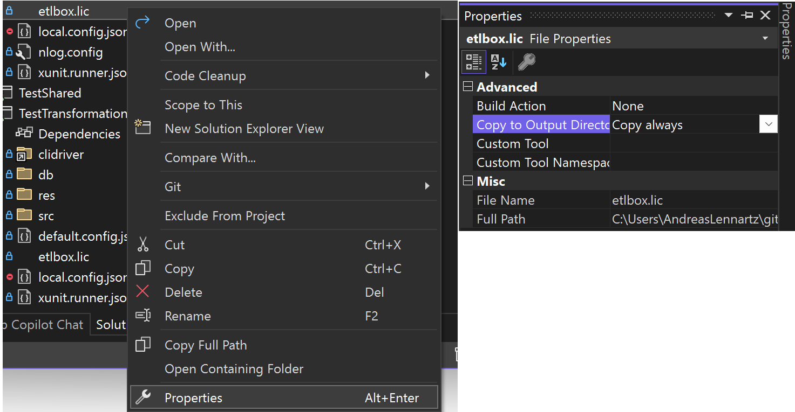

## License File Overview

When you purchase a license, you’ll receive a license file, typically named `etlbox.lic`. This file is encoded in UTF-8 and can be opened with any text editor. It’s human-readable and contains encrypted license information.

**Sample License File Content:**

```text
2010-01-01|COMPANY: 3DEVS|ANNUAL:2010-01-01|SUPPORT:STANDARD|CUSTOMER:ETLBoxperts GmbH|MAIL:support@etlbox.net||oPuwE+8bnjgELq1bJCf3PG5VRW9iY81ICgRZoRddVwd9FuEFSYddrz6PmP1u4g2QSQ+0hqvC/VRTm4ZgUJsJYqEOvr0tfYcL9l9enH1DgdTG5bInSLc7+C+vTxRbpHYn5Pz05YUA3IWqtv6LRfiakQlTxl8NYwUhgL249Q9x3Co=
```

## Register Your License Key

You can register your ETLBox license key in three different ways. Choose the method that best fits your environment.

### Option 1 - Programmatically (Recommended)

This is the preferred method, as it works in all environments.

- Open the `etlbox.lic` file with a text editor.
- Copy the entire content of the file.
- Add the following code to your project before executing any DataFlow:




```C#
using ETLBox.Licensing;
LicenseService.CurrentKey = "content_of_license_file";
```


```C#
using ETLBoxOffice.LicenseManager;
LicenseCheck.LicenseKey = "content_of_license_file";
```




Make sure this line is executed before any ETL operations start.



### Option 2 - Environment Variable

You can set the license key as an environment variable, which works across different systems and deployment environments.

- Set an environment variable named `etlbox`.
- Copy the content of your `etlbox.lic` file as the value of this variable.
- Restart your system or application if necessary.

#### Using Azure Functions or Azure Web Apps:

- Go to Configuration → App Settings in your Azure Function or Web App settings.
- Add a new setting:
  - Name: `etlbox`
  - Value: Paste the content of your `etlbox.lic` file.



### Option 3 - File-Based

You can place the `etlbox.lic` file directly alongside the ETLBox DLL.

- Copy `etlbox.lic` to the same folder as ETLBox.dll (usually the root of your project).

#### Visual Studio Projects

If you’re adding the license file to your project in Visual Studio, and you want to make sure that it is automatically copied into your output folder:

1. Right-click on `etlbox.lic` in **Solution Explorer**.
2. Select **Properties**.
3. Set **Copy to Output Directory** to either:
   - **Copy always**, or
   - **Copy if newer**.



#### Project File Configuration

If you prefer to edit the project file (`.csproj`) directly, add the following entry:

```xml
<ItemGroup>
  <None Update="etlbox.lic">
    <CopyToOutputDirectory>Always</CopyToOutputDirectory>
  </None>
</ItemGroup>
```

#### For Azure Functions / Web Apps:

- With File System Access:
  Deploy the `etlbox.lic` file to the same folder as your application files.

- Using Zip Deploy (No File System Access):
  - Add `etlbox.lic` as an embedded resource in your project.
  - ETLBox will automatically detect the license from the embedded resource during runtime.

## Troubleshooting License Issues

- Ensure the license key is registered before any ETL operations start.
- Double-check that the key or file content hasn’t been altered.
- For environment variables, restart your system or application after setting them.
- If using Azure, verify that the app settings are correctly applied.
- Still having issues? [Contact ETLBox Support for assistance](/support/options).

