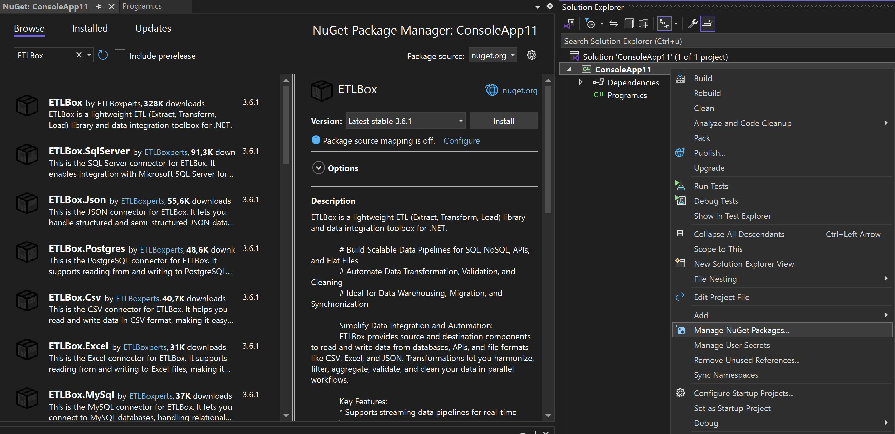

## Prerequisites

Before you get started, make sure your environment meets the following requirements:

- ETLBox supports current .NET versions supported by Microsoft, including  or later and .NET Framework 4.8.0 or later
- Recommended, but optional: A compatible IDE, such as ,  or .
- Basic knowledge of  programming and working with NuGet packages

## Step 1: Install ETLBox via NuGet

The easiest way to add ETLBox to your project is through NuGet. Follow these steps:

### Option 1: NuGet Package Manager

1. Open your project in **Visual Studio**.
2. Right-click on your project in the **Solution Explorer** and select **Manage NuGet Packages**.
3. Search for `ETLBox` in the **Browse** tab.
4. Select the package and click **Install**.



### Option 2: Using the .NET CLI

If you prefer the command line, run the following command(s) in your terminal. You will always need the core package (`ETLBox`).

Depending on your use case, you might need additional packages. For example:
- To work with SQL Server, you'll need `ETLBox.SqlServer`.
- For interacting with REST APIs that handle JSON, you'll require `ETLBox.Json`.
- You can explore .



```cmd
dotnet add package ETLBox
dotnet add package ETLBox.Json
```


```ps1
PM> NuGet\Install-Package ETLBox -Version 3.7.1
PM> NuGet\Install-Package ETLBox.Json -Version 3.7.1
```

This command is intended to be used within the Package Manager Console in Visual Studio, as it uses the NuGet module's version of .



```xml
<PackageReference Include="ETLBox" Version="3.7.1" />
<PackageReference Include="ETLBox.Json" Version="3.7.1" />
```

For projects that support , copy this XML node into the project file to reference the package.



```cmd
> #r "nuget: ETLBox, 3.7.1"
> #r "nuget: ETLBox.Json, 3.7.1"
```

#r directive can be used in F# Interactive and Polyglot Notebooks. Copy this into the interactive tool or source code of the script to reference the package.





## Step 2: Add ETLBox to Your Project

Once installed, you can start using ETLBox by adding the necessary `using` directives to your code. For example:

```csharp
using ETLBox.DataFlow;
using ETLBox.Json;
```

## Step 3: Test Your Installation

Here’s a quick example to verify everything is set up correctly. This example reads data from a REST API and loads it into a memory object, which is then printed to the console output:

```csharp
using ETLBox.DataFlow;
using ETLBox.Json;

//Define components
var jsonSource = new JsonSource();
jsonSource.Uri = "https://www.etlbox.net/api/simple";
jsonSource.ResourceType = ETLBox.ResourceType.Http;
var memDest = new MemoryDestination();

jsonSource.LinkTo(memDest); //Linking compontents
await Network.ExecuteAsync(jsonSource); //Executing the flow

//Print data to console output
foreach (dynamic record in memDest.Data)
    Console.WriteLine($"Id: {record.Id}, Value: {record.Value}");

```

### Troubleshooting Installation

If you encounter any issues during installation, consider these tips:

- **Verify Dependencies**: Ensure your project meets the required .NET version.
- **Check NuGet Cache**: Clear your NuGet cache if installation fails:
   ```bash
   dotnet nuget locals all --clear
   ```
- **Ask Us**: [Get in touch with our Support](/support/options) for additional help.

#### What’s Next?

With ETLBox installed and configured, you’re ready to start building robust ETL pipelines! Go to the **Quick Start Guide** for a step-by-step walkthrough.

