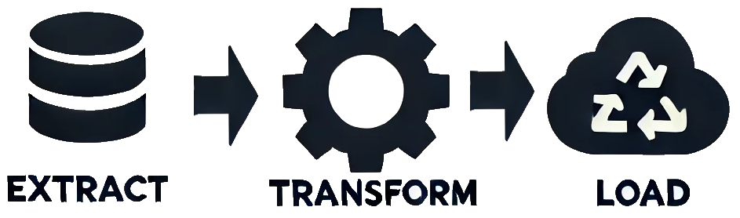

## What Is ETL?

Before diving into ETLBox, it's important to understand the fundamental concept it’s built around:

**ETL** (Extract, Transform, Load).

ETL is the backbone of data integration, helping organizations move and prepare data for analysis, reporting, and decision-making.

However, ETLBox isn’t limited to traditional ETL workflows. It’s also perfectly suited for **data integration tasks**, **bulk operations**, and any scenario that involves **mass-data processing**.

ETL involves three key steps:

- **Extract:** Collect data from various sources like databases, APIs, and files.
- **Transform:**:  Modify, clean, and structure the data to fit your needs.
- **Load:**: Place the processed data into a target system, such as a database, a data warehouse or a REST endpoint.

ETLBox helps you handle each of these steps with tools that fit into your existing .NET environment.



## Core Concepts of ETLBox

ETLBox is based on a few key components:

- **Data Flow Engine:** Manages the flow of data and supports parallel processing to handle large datasets efficiently.
- **Sources & Destinations:** Connects to databases, files, APIs, and more for both reading and writing data.
- **Transformations:** Allows you to apply changes to data as it moves through the pipeline, with options for custom logic.

### How ETLBox Works

ETLBox enables you to build data processing workflows by creating a network—or graph—of interconnected components. Here’s how it works:

1. **Define Components:** You start by defining the core components of your data flow:

   - **Sources** to read data from databases, files, APIs, etc.
   - **Transformations** to modify, clean, or aggregate the data.
   - **Destinations** to load the processed data into target systems like databases, flat files, or APIs.

2. **Link Components:** These components are connected to form a directed graph where data flows from sources through transformations and finally to destinations. The data can:

   - **Redirect/Split** into multiple paths for parallel processing.
   - **Join** from different sources to merge related datasets.
   - **Aggregate** to summarize large datasets.
   - **Transform/Lookup** for cleaning, harmonizing, and enriching data.

3. **Execute the Network:** Once the network is constructed, it is executed as a whole. ETLBox handles data flow management automatically:

   - Each component operates with **buffers** to manage data efficiently.
   - **Parallel Processing** is built-in, with data processed in separate tasks for high throughput.
   - Memory usage is optimized because only the data required for current operations and buffer storage is kept in memory.

This architecture allows ETLBox to scale efficiently, even when handling large volumes of data.

```kroki {type=mermaid}
%%{init: {'theme':'neutral'}}%%
flowchart LR
  S1[(Source 1)] --Extracts--> T1(Transformation 1)
  S2[(Source 2)] --Extracts--> T1(Transformation 1)
  T1 --Transforms--> T2(Transformation 2)
  T2 --Loads --> D[[Destination1]]
  T2 --Loads-->  E[[Destination2]]
```

### Applying These Concepts in Code

Now let's see how these concepts translate into a simple ETL pipeline. In this example, we'll extract data from a source, apply transformations, and load it into a destination.

```csharp
//Install ETLBox.Csv and ETLBox.Postgres package from nuget.org
using ETLBox.Csv;
using ETLBox.DataFlow;
using ETLBox.Postgres;

//Define components
var source = new CsvSource<MyRow>("input.csv");
var transformation = new RowTransformation<MyRow>();
transformation.TransformationFunc = row => {
    row.Value = row.Value.ToUpper();
    return row;
};
var connMan = new PostgresConnectionManager("ConnectionString");
var destination = new DbDestination<MyRow>() {
    ConnectionManager = connMan,
    TableName = "TargetTable"
};

// Link the components
source.LinkTo(transformation);
transformation.LinkTo(destination);

// Execute the data flow
//
await Network.ExecuteAsync(source);

public class MyRow {
    public int Id { get; set; }
    public string Value { get; set; }
}
```

In this code:

- **`CsvSource`** reads data from a CSV file.
- **`RowTransformation`** converts text to uppercase.
- **`DbDestination`** bulks insert the processed data into a database.
- **`LinkTo()`** connects the components to form a data flow network.
- **`Network.ExecuteAsync()`** determines the full graph recursively from the given components, and starts the process asynchrounously.


 The network execution automatically manages dependencies between components.
 It ensures that data flows smoothly from sources to destinations, while handling buffering, parallel processing, and synchronization of tasks internally.


## Why Choose ETLBox?

⌨️ **Code-First**: You work directly in C#, giving you full control over your data workflows without the constraints of a graphical interface. This code-first approach means you can manage ETL processes alongside your application code, using familiar tools and practices.

⚡**Performance**: ETLBox efficiently handles large datasets through built-in parallel processing and optimized memory management. This ensures your data pipelines run quickly and can scale as your data grows.

🔀 **Flexibility**: ETLBox supports a wide range of data sources and destinations, and you can easily customize transformations to fit your specific needs. Whether it's databases, APIs, or files, ETLBox adapts to your environment.

📦 **Built on .NET**: ETLBox runs on Windows, Linux, and macOS. It also integrates well with cloud services, making it a versatile choice for modern data integration tasks.


#### What's Next?

Now that you have an overview of what ETLBox is, the next step is to get it up and running. In the next article, we'll cover **installation and setup** so you can start building your first data pipeline.

