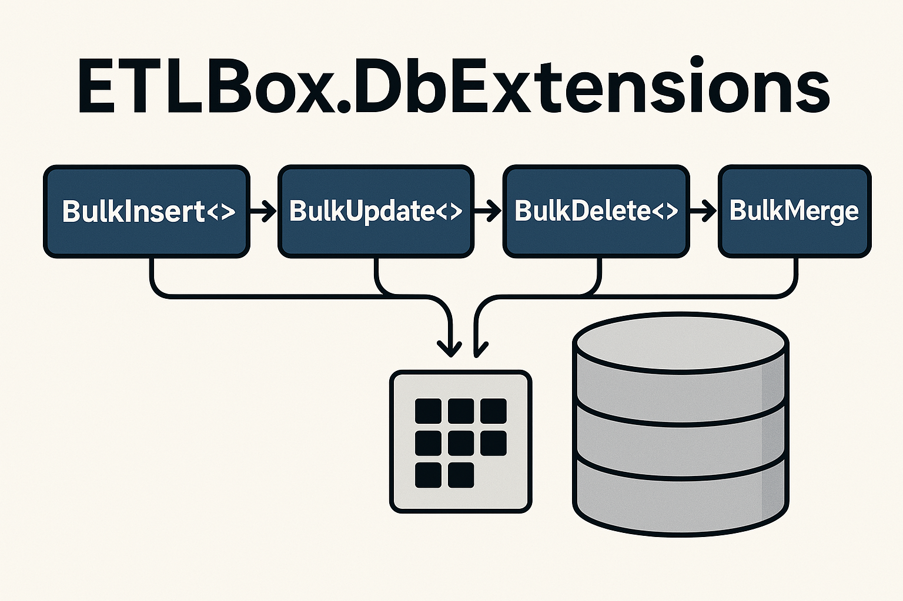

## Why ETLBox.DbExtensions?

Whether you're working with raw `IDbConnection` or using Dapper, you can now perform bulk inserts, updates, deletes, and merges with just one line of code.

- **Bulk operations for ADO.NET**: Insert, update, delete, or merge thousands of records with a single method call.

- **Built for Dapper**: Designed to integrate naturally into your existing Dapper setup.

- **Minimal setup**: No configuration. Just install the NuGet package and start coding.

## Supported Operations



`BulkInsert<T>()`: Insert large sets of data efficiently using database-native bulk loaders.

`BulkUpdate<T>()`: Update multiple records at once by matching on key columns.

`BulkDelete<T>()`: Delete multiple rows in a single operation based on ID column(s).

`BulkMerge<T>()`: Perform insert, update, or delete in one step — also known as merge or upsert.

## Works with All Major Databases

ETLBox.DbExtensions supports any ADO.NET connection backed by an ETLBox database provider, including:

- SQL Server
- PostgreSQL
- MySQL
- MariaDB
- SQLite
- Oracle
- IBM DB2
- Snowflake
- SAP ASE (Sybase)
- SAP HANA

## How It Works

The package extends `IDbConnection` with bulk operation methods. Internally, it converts the ADO.NET connection to an ETLBox `IConnectionManager` and uses the ETLBox data flow engine for optimized performance.

```csharp
var connection = new SqlConnection("your-connection-string");

// var dataToInsert = ...
connection.BulkInsert(dataToInsert);

// var dataToUpdate = ...
connection.BulkUpdate(dataToUpdate);

// var dataToDelete = ...
connection.BulkDelete(dataToDelete);

// var dataToMerge = ...
connection.BulkMerge(dataToMerge);
```

## What’s Next?

In the next article, we’ll walk through the **installation and initial setup** of ETLBox.DbExtensions — how to install the NuGet packages, add the right database provider, and run your first operation.

After that, each bulk operation will be covered in detail, with full examples and customization options.

